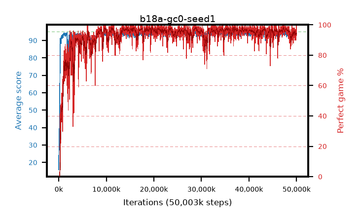

# b18a-gc0-seed1

step **50,003,968** · 3052 evals · trailing **93.9** · peak **94.49** @28,803,072 · sef **94.2** · best30 **97.8** @28,852,224

## Config

| | |
|---|---|
| algo | ppo |
| collect_envs | 128 |
| discount | 0.99 |
| eval_interval | 16384 |
| eval_queue | True |
| eval_queue_depth | 16 |
| eval_workers | 8 |
| fc_layers | (320,) |
| graph_eval_episodes | 100 |
| max_steps | 50003968 |
| min_checkpoint_score | 40.0 |
| ppo_adam_epsilon | 1e-07 |
| ppo_anneal_fraction | 1.0 |
| ppo_clip | 0.2 |
| ppo_clip_final | None |
| ppo_entropy_coef | 0.01 |
| ppo_entropy_coef_final | None |
| ppo_epochs | 4 |
| ppo_gae_lambda | 0.98 |
| ppo_gradient_clipping | 0.0 |
| ppo_horizon | 33.6 |
| ppo_learning_rate | 0.0003 |
| ppo_learning_rate_final | None |
| ppo_minibatch | 256 |
| ppo_normalize_adv | True |
| ppo_rollout | 128 |
| ppo_target_kl | 0.0 |
| ppo_transitions_per_rollout | 16384 |
| ppo_value_loss | huber |
| ppo_vf_coef | 0.5 |
| seed | 1 |
| torch_threads | 1 |

## Evals

| step | avg score | trailing avg | min score | max score | avg reward | perfect % | epsilon |
|---|---|---|---|---|---|---|---|
| 16384 | 15.78 | 22.47 | 1.0 | 37.0 | 13.679 | 0.0 |  |
| 32768 | 29.71 | 25.97 | 7.0 | 71.0 | 24.703 | 0.0 |  |
| 49152 | 27.04 | 23.99 | 4.0 | 53.0 | 22.045 | 0.0 |  |
| ... | ... | ... | ... | ... | ... | ... | ... |
| 49823744 | 94.02 | 93.89 | 67.0 | 95.0 | 182.661 | 90.0 |  |
| 49840128 | 93.75 | 93.85 | 63.0 | 95.0 | 186.446 | 94.0 |  |
| 49856512 | 94.65 | 93.87 | 73.0 | 95.0 | 189.334 | 96.0 |  |
| 49872896 | 92.84 | 93.81 | 20.0 | 95.0 | 184.517 | 93.0 |  |
| 49889280 | 94.59 | 93.79 | 68.0 | 95.0 | 190.295 | 97.0 |  |
| 49905664 | 93.58 | 93.88 | 8.0 | 95.0 | 185.286 | 93.0 |  |
| 49922048 | 94.07 | 93.86 | 67.0 | 95.0 | 184.78 | 92.0 |  |
| 49938432 | 93.69 | 93.87 | 31.0 | 95.0 | 187.354 | 95.0 |  |
| 49954816 | 93.84 | 93.78 | 62.0 | 95.0 | 185.5 | 93.0 |  |
| 49971200 | 93.69 | 93.82 | 62.0 | 95.0 | 187.409 | 95.0 |  |
| 49987584 | 92.71 | 93.87 | 26.0 | 95.0 | 184.395 | 93.0 |  |
| 50003968 | 94.64 | 93.9 | 59.0 | 95.0 | 192.356 | 99.0 |  |
