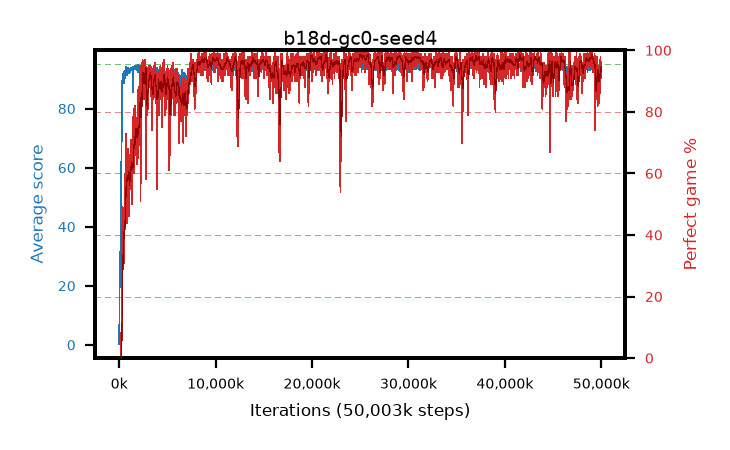

# b18d-gc0-seed4

step **50,003,968** · 3052 evals · trailing **93.65** · peak **94.58** @25,280,512 · sef **94.1** · best30 **98.3** @25,313,280

## Config

| | |
|---|---|
| algo | ppo |
| collect_envs | 128 |
| discount | 0.99 |
| eval_interval | 16384 |
| eval_queue | True |
| eval_queue_depth | 16 |
| eval_workers | 8 |
| fc_layers | (320,) |
| graph_eval_episodes | 100 |
| max_steps | 50003968 |
| min_checkpoint_score | 40.0 |
| ppo_adam_epsilon | 1e-07 |
| ppo_anneal_fraction | 1.0 |
| ppo_clip | 0.2 |
| ppo_clip_final | None |
| ppo_entropy_coef | 0.01 |
| ppo_entropy_coef_final | None |
| ppo_epochs | 4 |
| ppo_gae_lambda | 0.98 |
| ppo_gradient_clipping | 0.0 |
| ppo_horizon | 33.6 |
| ppo_learning_rate | 0.0003 |
| ppo_learning_rate_final | None |
| ppo_minibatch | 256 |
| ppo_normalize_adv | True |
| ppo_rollout | 128 |
| ppo_target_kl | 0.0 |
| ppo_transitions_per_rollout | 16384 |
| ppo_value_loss | huber |
| ppo_vf_coef | 0.5 |
| seed | 4 |
| torch_threads | 1 |

## Evals

| step | avg score | trailing avg | min score | max score | avg reward | perfect % | epsilon |
|---|---|---|---|---|---|---|---|
| 16384 | 0.26 | 0.26 | 0.0 | 2.0 | -0.515 | 0.0 |  |
| 32768 | 12.19 | 6.22 | 1.0 | 24.0 | 7.803 | 0.0 |  |
| 49152 | 22.95 | 11.8 | 4.0 | 37.0 | 17.921 | 0.0 |  |
| ... | ... | ... | ... | ... | ... | ... | ... |
| 49823744 | 94.1 | 93.59 | 67.0 | 95.0 | 185.809 | 93.0 |  |
| 49840128 | 94.19 | 93.6 | 54.0 | 95.0 | 189.846 | 97.0 |  |
| 49856512 | 94.24 | 93.66 | 64.0 | 95.0 | 188.941 | 96.0 |  |
| 49872896 | 93.96 | 93.59 | 18.0 | 95.0 | 189.585 | 97.0 |  |
| 49889280 | 92.24 | 93.49 | 38.0 | 95.0 | 176.879 | 86.0 |  |
| 49905664 | 93.78 | 93.44 | 34.0 | 95.0 | 187.484 | 95.0 |  |
| 49922048 | 94.65 | 93.55 | 76.0 | 95.0 | 191.338 | 98.0 |  |
| 49938432 | 91.68 | 93.49 | 8.0 | 95.0 | 181.38 | 91.0 |  |
| 49954816 | 92.69 | 93.52 | 10.0 | 95.0 | 186.385 | 95.0 |  |
| 49971200 | 94.26 | 93.69 | 71.0 | 95.0 | 188.971 | 96.0 |  |
| 49987584 | 94.2 | 93.69 | 68.0 | 95.0 | 187.919 | 95.0 |  |
| 50003968 | 93.08 | 93.65 | 16.0 | 95.0 | 185.806 | 94.0 |  |
