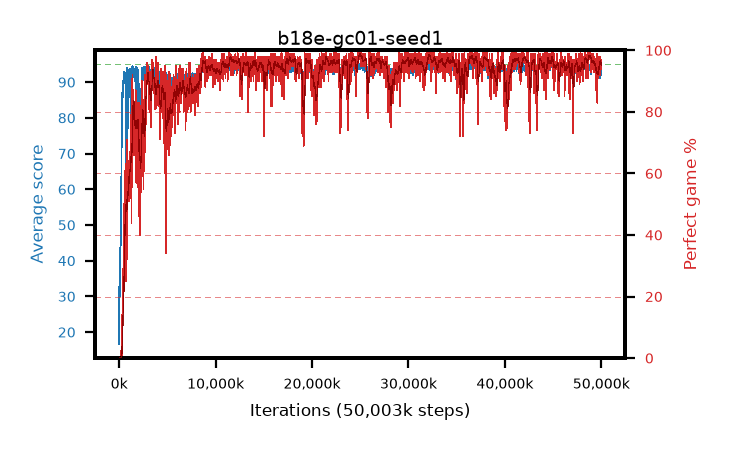

# b18e-gc01-seed1

step **50,003,968** · 3052 evals · trailing **93.88** · peak **94.53** @25,378,816 · sef **93.2** · best30 **98.1** @25,149,440

## Config

| | |
|---|---|
| algo | ppo |
| collect_envs | 128 |
| discount | 0.99 |
| eval_interval | 16384 |
| eval_queue | True |
| eval_queue_depth | 16 |
| eval_workers | 8 |
| fc_layers | (320,) |
| graph_eval_episodes | 100 |
| max_steps | 50003968 |
| min_checkpoint_score | 40.0 |
| ppo_adam_epsilon | 1e-07 |
| ppo_anneal_fraction | 1.0 |
| ppo_clip | 0.2 |
| ppo_clip_final | None |
| ppo_entropy_coef | 0.01 |
| ppo_entropy_coef_final | None |
| ppo_epochs | 4 |
| ppo_gae_lambda | 0.98 |
| ppo_gradient_clipping | 0.1 |
| ppo_horizon | 33.6 |
| ppo_learning_rate | 0.0003 |
| ppo_learning_rate_final | None |
| ppo_minibatch | 256 |
| ppo_normalize_adv | True |
| ppo_rollout | 128 |
| ppo_target_kl | 0.0 |
| ppo_transitions_per_rollout | 16384 |
| ppo_value_loss | huber |
| ppo_vf_coef | 0.5 |
| seed | 1 |
| torch_threads | 1 |

## Evals

| step | avg score | trailing avg | min score | max score | avg reward | perfect % | epsilon |
|---|---|---|---|---|---|---|---|
| 16384 | 16.64 | 16.64 | 1.0 | 41.0 | 14.468 | 0.0 |  |
| 32768 | 43.6 | 32.6 | 2.0 | 83.0 | 38.541 | 0.0 |  |
| 49152 | 34.5 | 30.4 | 1.0 | 75.0 | 29.511 | 0.0 |  |
| ... | ... | ... | ... | ... | ... | ... | ... |
| 49823744 | 93.27 | 93.85 | 12.0 | 95.0 | 188.945 | 97.0 |  |
| 49840128 | 94.19 | 93.77 | 16.0 | 95.0 | 190.82 | 98.0 |  |
| 49856512 | 91.22 | 93.77 | 16.0 | 95.0 | 181.835 | 92.0 |  |
| 49872896 | 93.8 | 93.77 | 19.0 | 95.0 | 188.483 | 96.0 |  |
| 49889280 | 94.65 | 93.81 | 66.0 | 95.0 | 190.362 | 97.0 |  |
| 49905664 | 94.1 | 93.82 | 18.0 | 95.0 | 189.82 | 97.0 |  |
| 49922048 | 93.17 | 93.82 | 20.0 | 95.0 | 185.849 | 94.0 |  |
| 49938432 | 94.43 | 93.78 | 65.0 | 95.0 | 190.146 | 97.0 |  |
| 49954816 | 94.41 | 93.84 | 54.0 | 95.0 | 188.078 | 95.0 |  |
| 49971200 | 91.89 | 93.79 | 11.0 | 95.0 | 184.495 | 94.0 |  |
| 49987584 | 92.97 | 93.82 | 10.0 | 95.0 | 185.606 | 94.0 |  |
| 50003968 | 93.01 | 93.88 | 17.0 | 95.0 | 186.651 | 95.0 |  |
