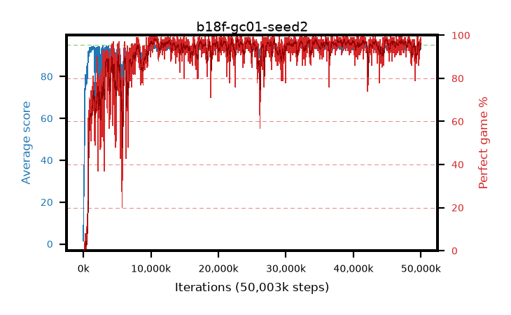

# b18f-gc01-seed2

step **50,003,968** · 3052 evals · trailing **93.64** · peak **94.5** @45,924,352 · sef **90.5** · best30 **98.2** @10,862,592

## Config

| | |
|---|---|
| algo | ppo |
| collect_envs | 128 |
| discount | 0.99 |
| eval_interval | 16384 |
| eval_queue | True |
| eval_queue_depth | 16 |
| eval_workers | 8 |
| fc_layers | (320,) |
| graph_eval_episodes | 100 |
| max_steps | 50003968 |
| min_checkpoint_score | 40.0 |
| ppo_adam_epsilon | 1e-07 |
| ppo_anneal_fraction | 1.0 |
| ppo_clip | 0.2 |
| ppo_clip_final | None |
| ppo_entropy_coef | 0.01 |
| ppo_entropy_coef_final | None |
| ppo_epochs | 4 |
| ppo_gae_lambda | 0.98 |
| ppo_gradient_clipping | 0.1 |
| ppo_horizon | 33.6 |
| ppo_learning_rate | 0.0003 |
| ppo_learning_rate_final | None |
| ppo_minibatch | 256 |
| ppo_normalize_adv | True |
| ppo_rollout | 128 |
| ppo_target_kl | 0.0 |
| ppo_transitions_per_rollout | 16384 |
| ppo_value_loss | huber |
| ppo_vf_coef | 0.5 |
| seed | 2 |
| torch_threads | 1 |

## Evals

| step | avg score | trailing avg | min score | max score | avg reward | perfect % | epsilon |
|---|---|---|---|---|---|---|---|
| 16384 | 1.47 | 1.47 | 0.0 | 4.0 | -0.69 | 0.0 |  |
| 32768 | 13.7 | 13.68 | 5.0 | 27.0 | 8.879 | 0.0 |  |
| 49152 | 26.81 | 16.96 | 7.0 | 51.0 | 21.843 | 0.0 |  |
| ... | ... | ... | ... | ... | ... | ... | ... |
| 49823744 | 93.13 | 93.61 | 16.0 | 95.0 | 184.828 | 93.0 |  |
| 49840128 | 94.0 | 93.56 | 22.0 | 95.0 | 189.722 | 97.0 |  |
| 49856512 | 93.67 | 93.57 | 3.0 | 95.0 | 188.386 | 96.0 |  |
| 49872896 | 93.7 | 93.51 | 59.0 | 95.0 | 188.425 | 96.0 |  |
| 49889280 | 93.2 | 93.55 | 22.0 | 95.0 | 185.875 | 94.0 |  |
| 49905664 | 94.72 | 93.6 | 70.0 | 95.0 | 191.428 | 98.0 |  |
| 49922048 | 94.49 | 93.57 | 71.0 | 95.0 | 189.199 | 96.0 |  |
| 49938432 | 94.6 | 93.62 | 74.0 | 95.0 | 189.31 | 96.0 |  |
| 49954816 | 94.2 | 93.62 | 32.0 | 95.0 | 187.873 | 95.0 |  |
| 49971200 | 93.19 | 93.59 | 9.0 | 95.0 | 187.918 | 96.0 |  |
| 49987584 | 94.93 | 93.64 | 88.0 | 95.0 | 192.634 | 99.0 |  |
| 50003968 | 94.66 | 93.64 | 64.0 | 95.0 | 191.377 | 98.0 |  |
