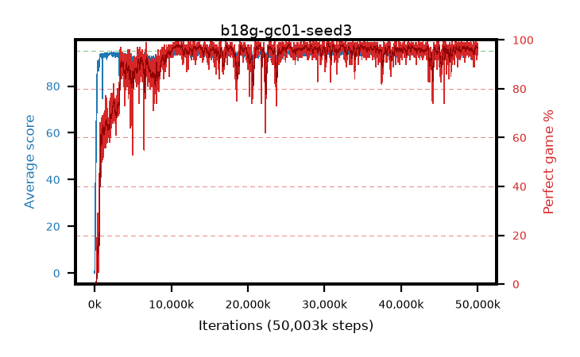

# b18g-gc01-seed3

step **50,003,968** · 3052 evals · trailing **94.31** · peak **94.54** @11,288,576 · sef **92.1** · best30 **97.8** @32,473,088

## Config

| | |
|---|---|
| algo | ppo |
| collect_envs | 128 |
| discount | 0.99 |
| eval_interval | 16384 |
| eval_queue | True |
| eval_queue_depth | 16 |
| eval_workers | 8 |
| fc_layers | (320,) |
| graph_eval_episodes | 100 |
| max_steps | 50003968 |
| min_checkpoint_score | 40.0 |
| ppo_adam_epsilon | 1e-07 |
| ppo_anneal_fraction | 1.0 |
| ppo_clip | 0.2 |
| ppo_clip_final | None |
| ppo_entropy_coef | 0.01 |
| ppo_entropy_coef_final | None |
| ppo_epochs | 4 |
| ppo_gae_lambda | 0.98 |
| ppo_gradient_clipping | 0.1 |
| ppo_horizon | 33.6 |
| ppo_learning_rate | 0.0003 |
| ppo_learning_rate_final | None |
| ppo_minibatch | 256 |
| ppo_normalize_adv | True |
| ppo_rollout | 128 |
| ppo_target_kl | 0.0 |
| ppo_transitions_per_rollout | 16384 |
| ppo_value_loss | huber |
| ppo_vf_coef | 0.5 |
| seed | 3 |
| torch_threads | 1 |

## Evals

| step | avg score | trailing avg | min score | max score | avg reward | perfect % | epsilon |
|---|---|---|---|---|---|---|---|
| 16384 | 0.04 | 0.04 | 0.0 | 1.0 | -3.717 | 0.0 |  |
| 32768 | 1.3 | 0.67 | 0.0 | 5.0 | 0.74 | 0.0 |  |
| 49152 | 17.88 | 11.38 | 2.0 | 38.0 | 13.449 | 0.0 |  |
| ... | ... | ... | ... | ... | ... | ... | ... |
| 49823744 | 94.59 | 94.13 | 63.0 | 95.0 | 191.311 | 98.0 |  |
| 49840128 | 93.83 | 94.14 | 40.0 | 95.0 | 188.52 | 96.0 |  |
| 49856512 | 93.2 | 94.1 | 4.0 | 95.0 | 183.939 | 92.0 |  |
| 49872896 | 94.63 | 94.19 | 83.0 | 95.0 | 189.351 | 96.0 |  |
| 49889280 | 94.84 | 94.27 | 87.0 | 95.0 | 191.556 | 98.0 |  |
| 49905664 | 94.77 | 94.35 | 83.0 | 95.0 | 191.486 | 98.0 |  |
| 49922048 | 94.89 | 94.11 | 84.0 | 95.0 | 192.6 | 99.0 |  |
| 49938432 | 94.39 | 94.33 | 64.0 | 95.0 | 190.11 | 97.0 |  |
| 49954816 | 94.77 | 94.37 | 83.0 | 95.0 | 191.484 | 98.0 |  |
| 49971200 | 94.06 | 94.34 | 8.0 | 95.0 | 190.777 | 98.0 |  |
| 49987584 | 93.5 | 94.32 | 16.0 | 95.0 | 187.223 | 95.0 |  |
| 50003968 | 94.86 | 94.31 | 86.0 | 95.0 | 190.583 | 97.0 |  |
