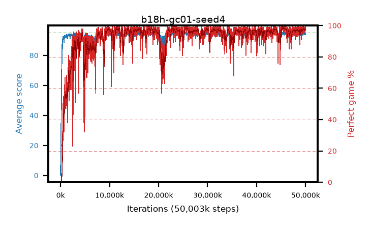

# b18h-gc01-seed4

step **50,003,968** · 3052 evals · trailing **94.36** · peak **94.68** @45,465,600 · sef **92.1** · best30 **98.6** @45,547,520

## Config

| | |
|---|---|
| algo | ppo |
| collect_envs | 128 |
| discount | 0.99 |
| eval_interval | 16384 |
| eval_queue | True |
| eval_queue_depth | 16 |
| eval_workers | 8 |
| fc_layers | (320,) |
| graph_eval_episodes | 100 |
| max_steps | 50003968 |
| min_checkpoint_score | 40.0 |
| ppo_adam_epsilon | 1e-07 |
| ppo_anneal_fraction | 1.0 |
| ppo_clip | 0.2 |
| ppo_clip_final | None |
| ppo_entropy_coef | 0.01 |
| ppo_entropy_coef_final | None |
| ppo_epochs | 4 |
| ppo_gae_lambda | 0.98 |
| ppo_gradient_clipping | 0.1 |
| ppo_horizon | 33.6 |
| ppo_learning_rate | 0.0003 |
| ppo_learning_rate_final | None |
| ppo_minibatch | 256 |
| ppo_normalize_adv | True |
| ppo_rollout | 128 |
| ppo_target_kl | 0.0 |
| ppo_transitions_per_rollout | 16384 |
| ppo_value_loss | huber |
| ppo_vf_coef | 0.5 |
| seed | 4 |
| torch_threads | 1 |

## Evals

| step | avg score | trailing avg | min score | max score | avg reward | perfect % | epsilon |
|---|---|---|---|---|---|---|---|
| 16384 | 0.24 | 0.24 | 0.0 | 2.0 | -0.801 | 0.0 |  |
| 32768 | 13.76 | 7.0 | 1.0 | 29.0 | 9.469 | 0.0 |  |
| 49152 | 23.51 | 15.94 | 6.0 | 49.0 | 18.481 | 0.0 |  |
| ... | ... | ... | ... | ... | ... | ... | ... |
| 49823744 | 94.46 | 94.31 | 54.0 | 95.0 | 190.119 | 97.0 |  |
| 49840128 | 93.6 | 94.3 | 16.0 | 95.0 | 188.322 | 96.0 |  |
| 49856512 | 94.56 | 94.31 | 72.0 | 95.0 | 189.26 | 96.0 |  |
| 49872896 | 94.66 | 94.31 | 77.0 | 95.0 | 191.381 | 98.0 |  |
| 49889280 | 94.15 | 94.3 | 60.0 | 95.0 | 189.872 | 97.0 |  |
| 49905664 | 94.12 | 94.33 | 26.0 | 95.0 | 189.825 | 97.0 |  |
| 49922048 | 94.01 | 94.36 | 16.0 | 95.0 | 190.699 | 98.0 |  |
| 49938432 | 94.91 | 94.38 | 88.0 | 95.0 | 191.572 | 98.0 |  |
| 49954816 | 94.58 | 94.34 | 61.0 | 95.0 | 190.282 | 97.0 |  |
| 49971200 | 93.62 | 94.35 | 25.0 | 95.0 | 189.249 | 97.0 |  |
| 49987584 | 94.72 | 94.36 | 74.0 | 95.0 | 191.435 | 98.0 |  |
| 50003968 | 94.84 | 94.36 | 79.0 | 95.0 | 192.535 | 99.0 |  |
