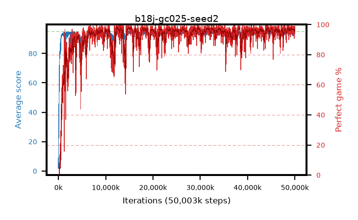

# b18j-gc025-seed2

step **50,003,968** · 3052 evals · trailing **93.81** · peak **94.46** @46,399,488 · sef **93.4** · best30 **97.7** @29,835,264

## Config

| | |
|---|---|
| algo | ppo |
| collect_envs | 128 |
| discount | 0.99 |
| eval_interval | 16384 |
| eval_queue | True |
| eval_queue_depth | 16 |
| eval_workers | 8 |
| fc_layers | (320,) |
| graph_eval_episodes | 100 |
| max_steps | 50003968 |
| min_checkpoint_score | 40.0 |
| ppo_adam_epsilon | 1e-07 |
| ppo_anneal_fraction | 1.0 |
| ppo_clip | 0.2 |
| ppo_clip_final | None |
| ppo_entropy_coef | 0.01 |
| ppo_entropy_coef_final | None |
| ppo_epochs | 4 |
| ppo_gae_lambda | 0.98 |
| ppo_gradient_clipping | 0.25 |
| ppo_horizon | 33.6 |
| ppo_learning_rate | 0.0003 |
| ppo_learning_rate_final | None |
| ppo_minibatch | 256 |
| ppo_normalize_adv | True |
| ppo_rollout | 128 |
| ppo_target_kl | 0.0 |
| ppo_transitions_per_rollout | 16384 |
| ppo_value_loss | huber |
| ppo_vf_coef | 0.5 |
| seed | 2 |
| torch_threads | 1 |

## Evals

| step | avg score | trailing avg | min score | max score | avg reward | perfect % | epsilon |
|---|---|---|---|---|---|---|---|
| 16384 | 1.88 | 1.88 | 0.0 | 5.0 | -0.903 | 0.0 |  |
| 32768 | 12.68 | 7.28 | 0.0 | 28.0 | 7.753 | 0.0 |  |
| 49152 | 26.14 | 18.7 | 6.0 | 60.0 | 21.128 | 0.0 |  |
| ... | ... | ... | ... | ... | ... | ... | ... |
| 49823744 | 93.22 | 93.81 | 30.0 | 95.0 | 185.911 | 94.0 |  |
| 49840128 | 94.83 | 93.83 | 78.0 | 95.0 | 192.537 | 99.0 |  |
| 49856512 | 94.66 | 93.84 | 80.0 | 95.0 | 189.335 | 96.0 |  |
| 49872896 | 93.17 | 93.72 | 48.0 | 95.0 | 182.797 | 91.0 |  |
| 49889280 | 91.86 | 93.78 | 4.0 | 95.0 | 182.508 | 92.0 |  |
| 49905664 | 94.23 | 93.79 | 58.0 | 95.0 | 188.959 | 96.0 |  |
| 49922048 | 93.25 | 93.72 | 10.0 | 95.0 | 188.885 | 97.0 |  |
| 49938432 | 94.84 | 93.75 | 79.0 | 95.0 | 192.539 | 99.0 |  |
| 49954816 | 93.39 | 93.75 | 2.0 | 95.0 | 190.05 | 98.0 |  |
| 49971200 | 94.05 | 93.74 | 11.0 | 95.0 | 189.721 | 97.0 |  |
| 49987584 | 94.91 | 93.81 | 89.0 | 95.0 | 191.629 | 98.0 |  |
| 50003968 | 93.53 | 93.81 | 30.0 | 95.0 | 187.191 | 95.0 |  |
