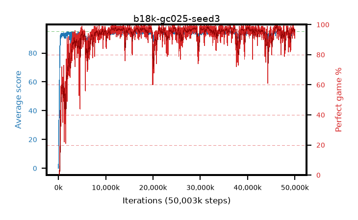

# b18k-gc025-seed3

step **50,003,968** · 3052 evals · trailing **94.29** · peak **94.57** @46,579,712 · sef **92.3** · best30 **98.5** @46,219,264

## Config

| | |
|---|---|
| algo | ppo |
| collect_envs | 128 |
| discount | 0.99 |
| eval_interval | 16384 |
| eval_queue | True |
| eval_queue_depth | 16 |
| eval_workers | 8 |
| fc_layers | (320,) |
| graph_eval_episodes | 100 |
| max_steps | 50003968 |
| min_checkpoint_score | 40.0 |
| ppo_adam_epsilon | 1e-07 |
| ppo_anneal_fraction | 1.0 |
| ppo_clip | 0.2 |
| ppo_clip_final | None |
| ppo_entropy_coef | 0.01 |
| ppo_entropy_coef_final | None |
| ppo_epochs | 4 |
| ppo_gae_lambda | 0.98 |
| ppo_gradient_clipping | 0.25 |
| ppo_horizon | 33.6 |
| ppo_learning_rate | 0.0003 |
| ppo_learning_rate_final | None |
| ppo_minibatch | 256 |
| ppo_normalize_adv | True |
| ppo_rollout | 128 |
| ppo_target_kl | 0.0 |
| ppo_transitions_per_rollout | 16384 |
| ppo_value_loss | huber |
| ppo_vf_coef | 0.5 |
| seed | 3 |
| torch_threads | 1 |

## Evals

| step | avg score | trailing avg | min score | max score | avg reward | perfect % | epsilon |
|---|---|---|---|---|---|---|---|
| 16384 | 0.03 | 0.03 | 0.0 | 1.0 | -2.716 | 0.0 |  |
| 32768 | 4.65 | 2.34 | 0.0 | 17.0 | 2.986 | 0.0 |  |
| 49152 | 20.65 | 12.01 | 0.0 | 47.0 | 16.401 | 0.0 |  |
| ... | ... | ... | ... | ... | ... | ... | ... |
| 49823744 | 94.77 | 94.29 | 80.0 | 95.0 | 190.477 | 97.0 |  |
| 49840128 | 94.93 | 94.3 | 92.0 | 95.0 | 190.613 | 97.0 |  |
| 49856512 | 93.14 | 94.33 | 12.0 | 95.0 | 186.849 | 95.0 |  |
| 49872896 | 94.58 | 94.33 | 72.0 | 95.0 | 190.281 | 97.0 |  |
| 49889280 | 94.01 | 94.35 | 20.0 | 95.0 | 189.72 | 97.0 |  |
| 49905664 | 94.77 | 94.32 | 79.0 | 95.0 | 190.478 | 97.0 |  |
| 49922048 | 92.33 | 94.28 | 12.0 | 95.0 | 183.057 | 92.0 |  |
| 49938432 | 94.7 | 94.3 | 83.0 | 95.0 | 190.396 | 97.0 |  |
| 49954816 | 94.3 | 94.3 | 61.0 | 95.0 | 188.015 | 95.0 |  |
| 49971200 | 94.09 | 94.3 | 62.0 | 95.0 | 183.804 | 91.0 |  |
| 49987584 | 94.52 | 94.29 | 79.0 | 95.0 | 189.226 | 96.0 |  |
| 50003968 | 94.23 | 94.29 | 79.0 | 95.0 | 184.93 | 92.0 |  |
