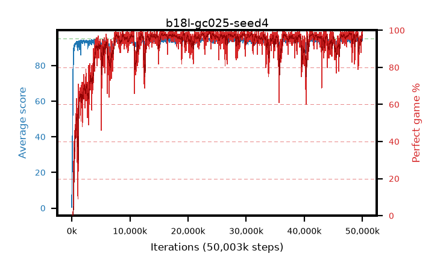

# b18l-gc025-seed4

step **50,003,968** · 3052 evals · trailing **93.99** · peak **94.61** @41,369,600 · sef **90.7** · best30 **98.4** @23,871,488

## Config

| | |
|---|---|
| algo | ppo |
| collect_envs | 128 |
| discount | 0.99 |
| eval_interval | 16384 |
| eval_queue | True |
| eval_queue_depth | 16 |
| eval_workers | 8 |
| fc_layers | (320,) |
| graph_eval_episodes | 100 |
| max_steps | 50003968 |
| min_checkpoint_score | 40.0 |
| ppo_adam_epsilon | 1e-07 |
| ppo_anneal_fraction | 1.0 |
| ppo_clip | 0.2 |
| ppo_clip_final | None |
| ppo_entropy_coef | 0.01 |
| ppo_entropy_coef_final | None |
| ppo_epochs | 4 |
| ppo_gae_lambda | 0.98 |
| ppo_gradient_clipping | 0.25 |
| ppo_horizon | 33.6 |
| ppo_learning_rate | 0.0003 |
| ppo_learning_rate_final | None |
| ppo_minibatch | 256 |
| ppo_normalize_adv | True |
| ppo_rollout | 128 |
| ppo_target_kl | 0.0 |
| ppo_transitions_per_rollout | 16384 |
| ppo_value_loss | huber |
| ppo_vf_coef | 0.5 |
| seed | 4 |
| torch_threads | 1 |

## Evals

| step | avg score | trailing avg | min score | max score | avg reward | perfect % | epsilon |
|---|---|---|---|---|---|---|---|
| 16384 | 0.47 | 0.47 | 0.0 | 2.0 | -0.492 | 0.0 |  |
| 32768 | 10.95 | 5.71 | 0.0 | 23.0 | 6.872 | 0.0 |  |
| 49152 | 24.05 | 15.17 | 3.0 | 42.0 | 19.055 | 0.0 |  |
| ... | ... | ... | ... | ... | ... | ... | ... |
| 49823744 | 94.72 | 93.86 | 72.0 | 95.0 | 191.418 | 98.0 |  |
| 49840128 | 94.37 | 93.9 | 76.0 | 95.0 | 189.08 | 96.0 |  |
| 49856512 | 94.26 | 93.92 | 56.0 | 95.0 | 187.922 | 95.0 |  |
| 49872896 | 93.88 | 93.89 | 18.0 | 95.0 | 190.584 | 98.0 |  |
| 49889280 | 94.72 | 94.0 | 67.0 | 95.0 | 192.421 | 99.0 |  |
| 49905664 | 94.11 | 94.02 | 46.0 | 95.0 | 189.74 | 97.0 |  |
| 49922048 | 95.0 | 94.02 | 95.0 | 95.0 | 193.693 | 100.0 |  |
| 49938432 | 94.5 | 94.02 | 67.0 | 95.0 | 189.206 | 96.0 |  |
| 49954816 | 94.85 | 94.04 | 85.0 | 95.0 | 191.556 | 98.0 |  |
| 49971200 | 95.0 | 94.11 | 95.0 | 95.0 | 193.711 | 100.0 |  |
| 49987584 | 94.18 | 94.01 | 31.0 | 95.0 | 189.855 | 97.0 |  |
| 50003968 | 94.05 | 93.99 | 62.0 | 95.0 | 188.763 | 96.0 |  |
