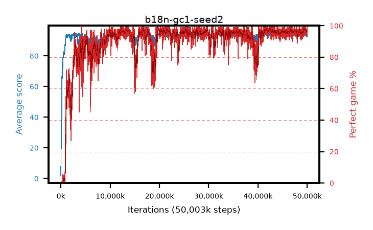

# b18n-gc1-seed2

step **50,003,968** · 3052 evals · trailing **94.17** · peak **94.46** @49,627,136 · sef **88.9** · best30 **97.8** @41,730,048

## Config

| | |
|---|---|
| algo | ppo |
| collect_envs | 128 |
| discount | 0.99 |
| eval_interval | 16384 |
| eval_queue | True |
| eval_queue_depth | 16 |
| eval_workers | 8 |
| fc_layers | (320,) |
| graph_eval_episodes | 100 |
| max_steps | 50003968 |
| min_checkpoint_score | 40.0 |
| ppo_adam_epsilon | 1e-07 |
| ppo_anneal_fraction | 1.0 |
| ppo_clip | 0.2 |
| ppo_clip_final | None |
| ppo_entropy_coef | 0.01 |
| ppo_entropy_coef_final | None |
| ppo_epochs | 4 |
| ppo_gae_lambda | 0.98 |
| ppo_gradient_clipping | 1.0 |
| ppo_horizon | 33.6 |
| ppo_learning_rate | 0.0003 |
| ppo_learning_rate_final | None |
| ppo_minibatch | 256 |
| ppo_normalize_adv | True |
| ppo_rollout | 128 |
| ppo_target_kl | 0.0 |
| ppo_transitions_per_rollout | 16384 |
| ppo_value_loss | huber |
| ppo_vf_coef | 0.5 |
| seed | 2 |
| torch_threads | 1 |

## Evals

| step | avg score | trailing avg | min score | max score | avg reward | perfect % | epsilon |
|---|---|---|---|---|---|---|---|
| 16384 | 1.74 | 1.74 | 0.0 | 6.0 | -0.73 | 0.0 |  |
| 32768 | 12.97 | 7.36 | 3.0 | 27.0 | 8.067 | 0.0 |  |
| 49152 | 23.17 | 15.47 | 2.0 | 54.0 | 18.384 | 0.0 |  |
| ... | ... | ... | ... | ... | ... | ... | ... |
| 49823744 | 94.43 | 94.26 | 65.0 | 95.0 | 190.137 | 97.0 |  |
| 49840128 | 94.6 | 94.32 | 69.0 | 95.0 | 189.281 | 96.0 |  |
| 49856512 | 92.81 | 94.27 | 22.0 | 95.0 | 184.419 | 93.0 |  |
| 49872896 | 94.37 | 94.27 | 71.0 | 95.0 | 189.043 | 96.0 |  |
| 49889280 | 94.62 | 94.31 | 73.0 | 95.0 | 189.28 | 96.0 |  |
| 49905664 | 94.59 | 94.26 | 56.0 | 95.0 | 191.26 | 98.0 |  |
| 49922048 | 92.44 | 94.21 | 26.0 | 95.0 | 186.045 | 95.0 |  |
| 49938432 | 93.75 | 94.2 | 56.0 | 95.0 | 188.473 | 96.0 |  |
| 49954816 | 95.0 | 94.26 | 95.0 | 95.0 | 193.715 | 100.0 |  |
| 49971200 | 93.96 | 94.23 | 48.0 | 95.0 | 187.637 | 95.0 |  |
| 49987584 | 93.72 | 94.19 | 23.0 | 95.0 | 187.352 | 95.0 |  |
| 50003968 | 94.27 | 94.17 | 44.0 | 95.0 | 188.938 | 96.0 |  |
