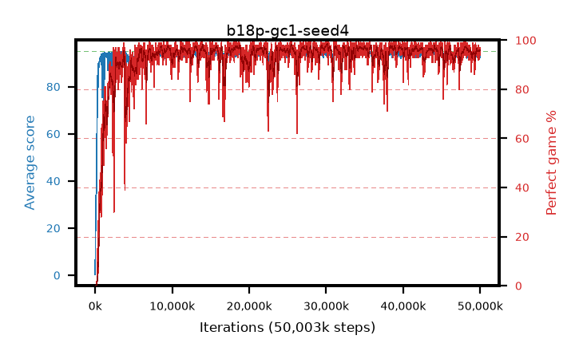

# b18p-gc1-seed4

step **50,003,968** · 3052 evals · trailing **94.02** · peak **94.43** @34,799,616 · sef **94.2** · best30 **97.7** @30,162,944

## Config

| | |
|---|---|
| algo | ppo |
| collect_envs | 128 |
| discount | 0.99 |
| eval_interval | 16384 |
| eval_queue | True |
| eval_queue_depth | 16 |
| eval_workers | 8 |
| fc_layers | (320,) |
| graph_eval_episodes | 100 |
| max_steps | 50003968 |
| min_checkpoint_score | 40.0 |
| ppo_adam_epsilon | 1e-07 |
| ppo_anneal_fraction | 1.0 |
| ppo_clip | 0.2 |
| ppo_clip_final | None |
| ppo_entropy_coef | 0.01 |
| ppo_entropy_coef_final | None |
| ppo_epochs | 4 |
| ppo_gae_lambda | 0.98 |
| ppo_gradient_clipping | 1.0 |
| ppo_horizon | 33.6 |
| ppo_learning_rate | 0.0003 |
| ppo_learning_rate_final | None |
| ppo_minibatch | 256 |
| ppo_normalize_adv | True |
| ppo_rollout | 128 |
| ppo_target_kl | 0.0 |
| ppo_transitions_per_rollout | 16384 |
| ppo_value_loss | huber |
| ppo_vf_coef | 0.5 |
| seed | 4 |
| torch_threads | 1 |

## Evals

| step | avg score | trailing avg | min score | max score | avg reward | perfect % | epsilon |
|---|---|---|---|---|---|---|---|
| 16384 | 0.3 | 0.3 | 0.0 | 2.0 | -0.652 | 0.0 |  |
| 32768 | 12.35 | 6.33 | 2.0 | 23.0 | 7.959 | 0.0 |  |
| 49152 | 22.17 | 11.61 | 3.0 | 44.0 | 17.122 | 0.0 |  |
| ... | ... | ... | ... | ... | ... | ... | ... |
| 49823744 | 92.56 | 94.34 | 3.0 | 95.0 | 183.226 | 92.0 |  |
| 49840128 | 94.59 | 94.34 | 79.0 | 95.0 | 189.298 | 96.0 |  |
| 49856512 | 94.65 | 94.35 | 75.0 | 95.0 | 190.328 | 97.0 |  |
| 49872896 | 93.81 | 94.31 | 5.0 | 95.0 | 188.512 | 96.0 |  |
| 49889280 | 93.86 | 94.24 | 3.0 | 95.0 | 188.532 | 96.0 |  |
| 49905664 | 93.67 | 94.27 | 1.0 | 95.0 | 187.38 | 95.0 |  |
| 49922048 | 92.4 | 94.16 | 12.0 | 95.0 | 186.055 | 95.0 |  |
| 49938432 | 94.91 | 94.26 | 90.0 | 95.0 | 190.605 | 97.0 |  |
| 49954816 | 94.09 | 94.24 | 8.0 | 95.0 | 189.784 | 97.0 |  |
| 49971200 | 94.32 | 94.08 | 61.0 | 95.0 | 188.969 | 96.0 |  |
| 49987584 | 92.39 | 94.08 | 1.0 | 95.0 | 187.109 | 96.0 |  |
| 50003968 | 92.49 | 94.02 | 2.0 | 95.0 | 185.158 | 94.0 |  |
