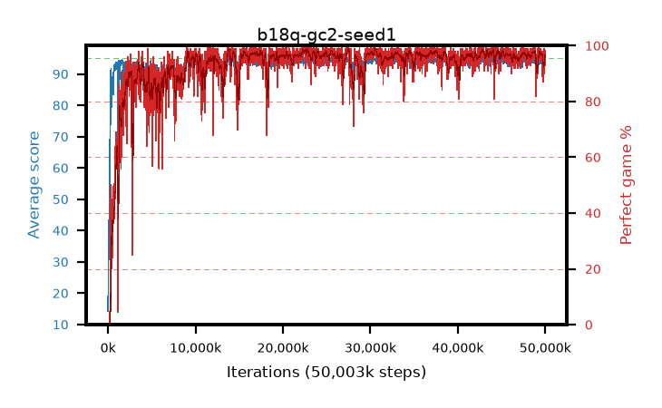

# b18q-gc2-seed1

step **50,003,968** · 3052 evals · trailing **94.08** · peak **94.64** @30,736,384 · sef **94.8** · best30 **98.2** @22,560,768

## Config

| | |
|---|---|
| algo | ppo |
| collect_envs | 128 |
| discount | 0.99 |
| eval_interval | 16384 |
| eval_queue | True |
| eval_queue_depth | 16 |
| eval_workers | 8 |
| fc_layers | (320,) |
| graph_eval_episodes | 100 |
| max_steps | 50003968 |
| min_checkpoint_score | 40.0 |
| ppo_adam_epsilon | 1e-07 |
| ppo_anneal_fraction | 1.0 |
| ppo_clip | 0.2 |
| ppo_clip_final | None |
| ppo_entropy_coef | 0.01 |
| ppo_entropy_coef_final | None |
| ppo_epochs | 4 |
| ppo_gae_lambda | 0.98 |
| ppo_gradient_clipping | 2.0 |
| ppo_horizon | 33.6 |
| ppo_learning_rate | 0.0003 |
| ppo_learning_rate_final | None |
| ppo_minibatch | 256 |
| ppo_normalize_adv | True |
| ppo_rollout | 128 |
| ppo_target_kl | 0.0 |
| ppo_transitions_per_rollout | 16384 |
| ppo_value_loss | huber |
| ppo_vf_coef | 0.5 |
| seed | 1 |
| torch_threads | 1 |

## Evals

| step | avg score | trailing avg | min score | max score | avg reward | perfect % | epsilon |
|---|---|---|---|---|---|---|---|
| 16384 | 14.37 | 22.73 | 1.0 | 41.0 | 12.773 | 0.0 |  |
| 32768 | 21.97 | 27.79 | 1.0 | 87.0 | 19.441 | 0.0 |  |
| 49152 | 35.02 | 26.83 | 8.0 | 65.0 | 29.993 | 0.0 |  |
| ... | ... | ... | ... | ... | ... | ... | ... |
| 49823744 | 93.65 | 94.03 | 65.0 | 95.0 | 182.353 | 90.0 |  |
| 49840128 | 94.65 | 94.03 | 67.0 | 95.0 | 190.295 | 97.0 |  |
| 49856512 | 94.67 | 94.06 | 62.0 | 95.0 | 192.36 | 99.0 |  |
| 49872896 | 94.79 | 94.08 | 81.0 | 95.0 | 191.494 | 98.0 |  |
| 49889280 | 94.52 | 94.08 | 71.0 | 95.0 | 190.218 | 97.0 |  |
| 49905664 | 94.36 | 94.07 | 61.0 | 95.0 | 191.033 | 98.0 |  |
| 49922048 | 94.95 | 94.07 | 90.0 | 95.0 | 192.647 | 99.0 |  |
| 49938432 | 93.85 | 94.11 | 45.0 | 95.0 | 187.512 | 95.0 |  |
| 49954816 | 93.53 | 94.08 | 34.0 | 95.0 | 185.096 | 93.0 |  |
| 49971200 | 93.77 | 94.07 | 26.0 | 95.0 | 188.399 | 96.0 |  |
| 49987584 | 94.33 | 94.07 | 64.0 | 95.0 | 189.0 | 96.0 |  |
| 50003968 | 94.65 | 94.08 | 76.0 | 95.0 | 189.35 | 96.0 |  |
