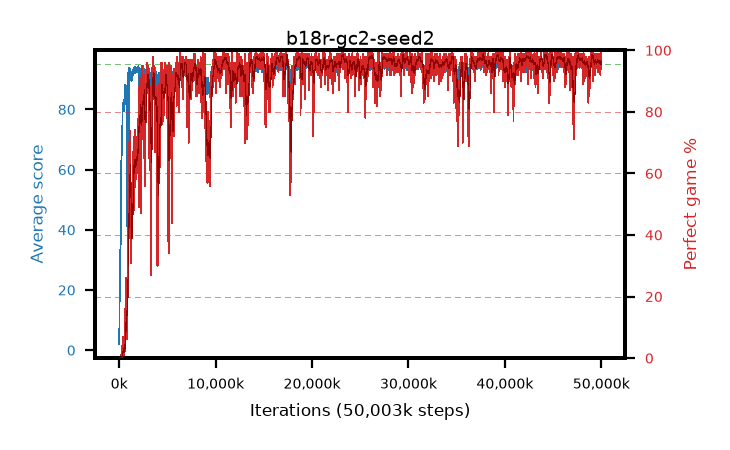

# b18r-gc2-seed2

step **50,003,968** · 3052 evals · trailing **94.31** · peak **94.6** @45,645,824 · sef **91.1** · best30 **97.9** @26,263,552

## Config

| | |
|---|---|
| algo | ppo |
| collect_envs | 128 |
| discount | 0.99 |
| eval_interval | 16384 |
| eval_queue | True |
| eval_queue_depth | 16 |
| eval_workers | 8 |
| fc_layers | (320,) |
| graph_eval_episodes | 100 |
| max_steps | 50003968 |
| min_checkpoint_score | 40.0 |
| ppo_adam_epsilon | 1e-07 |
| ppo_anneal_fraction | 1.0 |
| ppo_clip | 0.2 |
| ppo_clip_final | None |
| ppo_entropy_coef | 0.01 |
| ppo_entropy_coef_final | None |
| ppo_epochs | 4 |
| ppo_gae_lambda | 0.98 |
| ppo_gradient_clipping | 2.0 |
| ppo_horizon | 33.6 |
| ppo_learning_rate | 0.0003 |
| ppo_learning_rate_final | None |
| ppo_minibatch | 256 |
| ppo_normalize_adv | True |
| ppo_rollout | 128 |
| ppo_target_kl | 0.0 |
| ppo_transitions_per_rollout | 16384 |
| ppo_value_loss | huber |
| ppo_vf_coef | 0.5 |
| seed | 2 |
| torch_threads | 1 |

## Evals

| step | avg score | trailing avg | min score | max score | avg reward | perfect % | epsilon |
|---|---|---|---|---|---|---|---|
| 16384 | 2.03 | 2.03 | 0.0 | 7.0 | -0.757 | 0.0 |  |
| 32768 | 11.13 | 6.58 | 4.0 | 23.0 | 6.204 | 0.0 |  |
| 49152 | 24.82 | 12.66 | 6.0 | 53.0 | 19.816 | 0.0 |  |
| ... | ... | ... | ... | ... | ... | ... | ... |
| 49823744 | 93.4 | 94.29 | 27.0 | 95.0 | 188.083 | 96.0 |  |
| 49840128 | 94.7 | 94.31 | 84.0 | 95.0 | 189.399 | 96.0 |  |
| 49856512 | 94.61 | 94.3 | 74.0 | 95.0 | 189.333 | 96.0 |  |
| 49872896 | 94.82 | 94.31 | 84.0 | 95.0 | 191.519 | 98.0 |  |
| 49889280 | 93.72 | 94.31 | 22.0 | 95.0 | 187.43 | 95.0 |  |
| 49905664 | 93.82 | 94.29 | 62.0 | 95.0 | 184.497 | 92.0 |  |
| 49922048 | 94.03 | 94.28 | 26.0 | 95.0 | 188.742 | 96.0 |  |
| 49938432 | 94.39 | 94.35 | 63.0 | 95.0 | 189.068 | 96.0 |  |
| 49954816 | 93.29 | 94.28 | 6.0 | 95.0 | 187.971 | 96.0 |  |
| 49971200 | 94.5 | 94.31 | 82.0 | 95.0 | 187.197 | 94.0 |  |
| 49987584 | 94.94 | 94.32 | 89.0 | 95.0 | 192.657 | 99.0 |  |
| 50003968 | 95.0 | 94.31 | 95.0 | 95.0 | 193.705 | 100.0 |  |
