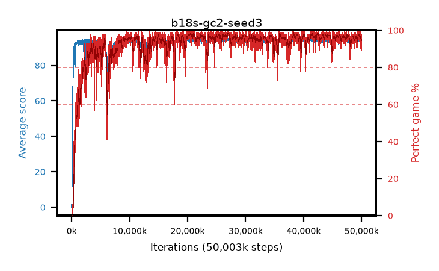

# b18s-gc2-seed3

step **50,003,968** · 3052 evals · trailing **94.17** · peak **94.54** @26,869,760 · sef **93.1** · best30 **97.9** @20,496,384

## Config

| | |
|---|---|
| algo | ppo |
| collect_envs | 128 |
| discount | 0.99 |
| eval_interval | 16384 |
| eval_queue | True |
| eval_queue_depth | 16 |
| eval_workers | 8 |
| fc_layers | (320,) |
| graph_eval_episodes | 100 |
| max_steps | 50003968 |
| min_checkpoint_score | 40.0 |
| ppo_adam_epsilon | 1e-07 |
| ppo_anneal_fraction | 1.0 |
| ppo_clip | 0.2 |
| ppo_clip_final | None |
| ppo_entropy_coef | 0.01 |
| ppo_entropy_coef_final | None |
| ppo_epochs | 4 |
| ppo_gae_lambda | 0.98 |
| ppo_gradient_clipping | 2.0 |
| ppo_horizon | 33.6 |
| ppo_learning_rate | 0.0003 |
| ppo_learning_rate_final | None |
| ppo_minibatch | 256 |
| ppo_normalize_adv | True |
| ppo_rollout | 128 |
| ppo_target_kl | 0.0 |
| ppo_transitions_per_rollout | 16384 |
| ppo_value_loss | huber |
| ppo_vf_coef | 0.5 |
| seed | 3 |
| torch_threads | 1 |

## Evals

| step | avg score | trailing avg | min score | max score | avg reward | perfect % | epsilon |
|---|---|---|---|---|---|---|---|
| 16384 | 0.03 | 0.03 | 0.0 | 1.0 | -2.925 | 0.0 |  |
| 32768 | 2.85 | 1.44 | 1.0 | 13.0 | 1.734 | 0.0 |  |
| 49152 | 20.38 | 7.75 | 0.0 | 38.0 | 15.775 | 0.0 |  |
| ... | ... | ... | ... | ... | ... | ... | ... |
| 49823744 | 92.97 | 94.3 | 8.0 | 95.0 | 181.618 | 90.0 |  |
| 49840128 | 92.68 | 94.22 | 10.0 | 95.0 | 185.316 | 94.0 |  |
| 49856512 | 93.45 | 94.17 | 46.0 | 95.0 | 184.127 | 92.0 |  |
| 49872896 | 94.64 | 94.29 | 80.0 | 95.0 | 190.348 | 97.0 |  |
| 49889280 | 93.84 | 94.26 | 56.0 | 95.0 | 187.564 | 95.0 |  |
| 49905664 | 95.0 | 94.28 | 95.0 | 95.0 | 193.712 | 100.0 |  |
| 49922048 | 93.57 | 94.25 | 54.0 | 95.0 | 186.298 | 94.0 |  |
| 49938432 | 94.22 | 94.2 | 39.0 | 95.0 | 189.907 | 97.0 |  |
| 49954816 | 93.85 | 94.24 | 16.0 | 95.0 | 190.56 | 98.0 |  |
| 49971200 | 93.2 | 94.23 | 66.0 | 95.0 | 180.927 | 89.0 |  |
| 49987584 | 93.03 | 94.18 | 20.0 | 95.0 | 180.71 | 89.0 |  |
| 50003968 | 94.34 | 94.17 | 55.0 | 95.0 | 190.053 | 97.0 |  |
