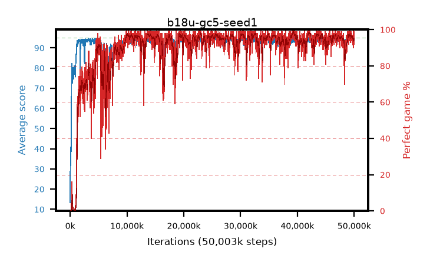

# b18u-gc5-seed1

step **50,003,968** · 3052 evals · trailing **94.05** · peak **94.48** @30,310,400 · sef **86.6** · best30 **98.0** @39,518,208

## Config

| | |
|---|---|
| algo | ppo |
| collect_envs | 128 |
| discount | 0.99 |
| eval_interval | 16384 |
| eval_queue | True |
| eval_queue_depth | 16 |
| eval_workers | 8 |
| fc_layers | (320,) |
| graph_eval_episodes | 100 |
| max_steps | 50003968 |
| min_checkpoint_score | 40.0 |
| ppo_adam_epsilon | 1e-07 |
| ppo_anneal_fraction | 1.0 |
| ppo_clip | 0.2 |
| ppo_clip_final | None |
| ppo_entropy_coef | 0.01 |
| ppo_entropy_coef_final | None |
| ppo_epochs | 4 |
| ppo_gae_lambda | 0.98 |
| ppo_gradient_clipping | 5.0 |
| ppo_horizon | 33.6 |
| ppo_learning_rate | 0.0003 |
| ppo_learning_rate_final | None |
| ppo_minibatch | 256 |
| ppo_normalize_adv | True |
| ppo_rollout | 128 |
| ppo_target_kl | 0.0 |
| ppo_transitions_per_rollout | 16384 |
| ppo_value_loss | huber |
| ppo_vf_coef | 0.5 |
| seed | 1 |
| torch_threads | 1 |

## Evals

| step | avg score | trailing avg | min score | max score | avg reward | perfect % | epsilon |
|---|---|---|---|---|---|---|---|
| 16384 | 13.31 | 13.31 | 1.0 | 33.0 | 10.126 | 0.0 |  |
| 32768 | 39.36 | 26.34 | 1.0 | 61.0 | 34.343 | 0.0 |  |
| 49152 | 40.93 | 31.65 | 14.0 | 74.0 | 35.831 | 0.0 |  |
| ... | ... | ... | ... | ... | ... | ... | ... |
| 49823744 | 93.84 | 94.2 | 74.0 | 95.0 | 182.549 | 90.0 |  |
| 49840128 | 94.76 | 94.16 | 86.0 | 95.0 | 190.468 | 97.0 |  |
| 49856512 | 95.0 | 94.15 | 95.0 | 95.0 | 193.709 | 100.0 |  |
| 49872896 | 93.86 | 94.12 | 40.0 | 95.0 | 184.581 | 92.0 |  |
| 49889280 | 93.05 | 94.16 | 12.0 | 95.0 | 182.775 | 91.0 |  |
| 49905664 | 94.68 | 94.23 | 78.0 | 95.0 | 189.4 | 96.0 |  |
| 49922048 | 94.65 | 94.18 | 60.0 | 95.0 | 192.348 | 99.0 |  |
| 49938432 | 93.73 | 94.19 | 58.0 | 95.0 | 186.45 | 94.0 |  |
| 49954816 | 92.62 | 94.13 | 14.0 | 95.0 | 183.35 | 92.0 |  |
| 49971200 | 94.7 | 94.22 | 65.0 | 95.0 | 192.406 | 99.0 |  |
| 49987584 | 93.29 | 94.05 | 32.0 | 95.0 | 187.018 | 95.0 |  |
| 50003968 | 94.04 | 94.05 | 48.0 | 95.0 | 188.721 | 96.0 |  |
