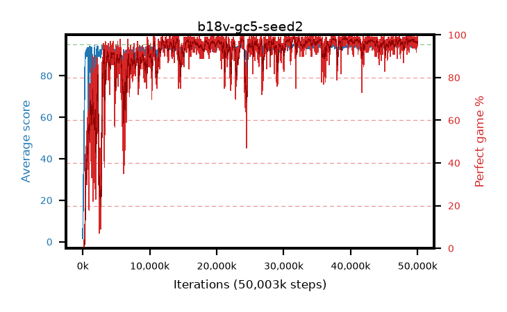

# b18v-gc5-seed2

step **50,003,968** · 3052 evals · trailing **94.4** · peak **94.66** @48,922,624 · sef **90.4** · best30 **98.4** @39,174,144

## Config

| | |
|---|---|
| algo | ppo |
| collect_envs | 128 |
| discount | 0.99 |
| eval_interval | 16384 |
| eval_queue | True |
| eval_queue_depth | 16 |
| eval_workers | 8 |
| fc_layers | (320,) |
| graph_eval_episodes | 100 |
| max_steps | 50003968 |
| min_checkpoint_score | 40.0 |
| ppo_adam_epsilon | 1e-07 |
| ppo_anneal_fraction | 1.0 |
| ppo_clip | 0.2 |
| ppo_clip_final | None |
| ppo_entropy_coef | 0.01 |
| ppo_entropy_coef_final | None |
| ppo_epochs | 4 |
| ppo_gae_lambda | 0.98 |
| ppo_gradient_clipping | 5.0 |
| ppo_horizon | 33.6 |
| ppo_learning_rate | 0.0003 |
| ppo_learning_rate_final | None |
| ppo_minibatch | 256 |
| ppo_normalize_adv | True |
| ppo_rollout | 128 |
| ppo_target_kl | 0.0 |
| ppo_transitions_per_rollout | 16384 |
| ppo_value_loss | huber |
| ppo_vf_coef | 0.5 |
| seed | 2 |
| torch_threads | 1 |

## Evals

| step | avg score | trailing avg | min score | max score | avg reward | perfect % | epsilon |
|---|---|---|---|---|---|---|---|
| 16384 | 1.54 | 1.54 | 0.0 | 4.0 | -0.797 | 0.0 |  |
| 32768 | 11.97 | 6.76 | 3.0 | 21.0 | 7.029 | 0.0 |  |
| 49152 | 22.45 | 11.99 | 7.0 | 42.0 | 17.457 | 0.0 |  |
| ... | ... | ... | ... | ... | ... | ... | ... |
| 49823744 | 93.88 | 94.46 | 56.0 | 95.0 | 187.563 | 95.0 |  |
| 49840128 | 93.91 | 94.36 | 18.0 | 95.0 | 188.595 | 96.0 |  |
| 49856512 | 94.87 | 94.43 | 82.0 | 95.0 | 192.581 | 99.0 |  |
| 49872896 | 94.43 | 94.42 | 65.0 | 95.0 | 190.152 | 97.0 |  |
| 49889280 | 93.42 | 94.43 | 6.0 | 95.0 | 190.143 | 98.0 |  |
| 49905664 | 94.63 | 94.38 | 86.0 | 95.0 | 188.343 | 95.0 |  |
| 49922048 | 94.62 | 94.42 | 67.0 | 95.0 | 190.347 | 97.0 |  |
| 49938432 | 94.72 | 94.41 | 80.0 | 95.0 | 191.43 | 98.0 |  |
| 49954816 | 94.22 | 94.38 | 58.0 | 95.0 | 187.944 | 95.0 |  |
| 49971200 | 94.26 | 94.4 | 75.0 | 95.0 | 187.978 | 95.0 |  |
| 49987584 | 94.68 | 94.43 | 80.0 | 95.0 | 190.405 | 97.0 |  |
| 50003968 | 94.75 | 94.4 | 70.0 | 95.0 | 192.47 | 99.0 |  |
