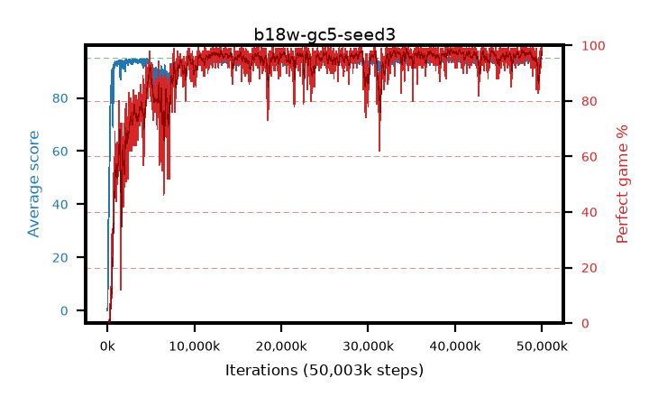

# b18w-gc5-seed3

step **50,003,968** · 3052 evals · trailing **93.91** · peak **94.63** @39,485,440 · sef **89.6** · best30 **98.0** @39,485,440

## Config

| | |
|---|---|
| algo | ppo |
| collect_envs | 128 |
| discount | 0.99 |
| eval_interval | 16384 |
| eval_queue | True |
| eval_queue_depth | 16 |
| eval_workers | 8 |
| fc_layers | (320,) |
| graph_eval_episodes | 100 |
| max_steps | 50003968 |
| min_checkpoint_score | 40.0 |
| ppo_adam_epsilon | 1e-07 |
| ppo_anneal_fraction | 1.0 |
| ppo_clip | 0.2 |
| ppo_clip_final | None |
| ppo_entropy_coef | 0.01 |
| ppo_entropy_coef_final | None |
| ppo_epochs | 4 |
| ppo_gae_lambda | 0.98 |
| ppo_gradient_clipping | 5.0 |
| ppo_horizon | 33.6 |
| ppo_learning_rate | 0.0003 |
| ppo_learning_rate_final | None |
| ppo_minibatch | 256 |
| ppo_normalize_adv | True |
| ppo_rollout | 128 |
| ppo_target_kl | 0.0 |
| ppo_transitions_per_rollout | 16384 |
| ppo_value_loss | huber |
| ppo_vf_coef | 0.5 |
| seed | 3 |
| torch_threads | 1 |

## Evals

| step | avg score | trailing avg | min score | max score | avg reward | perfect % | epsilon |
|---|---|---|---|---|---|---|---|
| 16384 | 0.04 | 0.04 | 0.0 | 1.0 | -0.51 | 0.0 |  |
| 32768 | 1.34 | 0.69 | 0.0 | 5.0 | 0.777 | 0.0 |  |
| 49152 | 12.59 | 8.77 | 0.0 | 36.0 | 8.614 | 0.0 |  |
| ... | ... | ... | ... | ... | ... | ... | ... |
| 49823744 | 92.95 | 93.56 | 6.0 | 95.0 | 183.628 | 92.0 |  |
| 49840128 | 94.45 | 93.59 | 75.0 | 95.0 | 190.169 | 97.0 |  |
| 49856512 | 94.08 | 93.63 | 16.0 | 95.0 | 190.806 | 98.0 |  |
| 49872896 | 94.52 | 93.61 | 75.0 | 95.0 | 189.23 | 96.0 |  |
| 49889280 | 94.94 | 93.63 | 89.0 | 95.0 | 192.664 | 99.0 |  |
| 49905664 | 94.57 | 93.73 | 62.0 | 95.0 | 191.282 | 98.0 |  |
| 49922048 | 95.0 | 93.7 | 95.0 | 95.0 | 193.704 | 100.0 |  |
| 49938432 | 94.67 | 93.74 | 81.0 | 95.0 | 190.385 | 97.0 |  |
| 49954816 | 94.65 | 93.85 | 77.0 | 95.0 | 190.375 | 97.0 |  |
| 49971200 | 94.7 | 93.79 | 83.0 | 95.0 | 190.422 | 97.0 |  |
| 49987584 | 94.95 | 94.01 | 90.0 | 95.0 | 192.66 | 99.0 |  |
| 50003968 | 94.63 | 93.91 | 68.0 | 95.0 | 190.341 | 97.0 |  |
