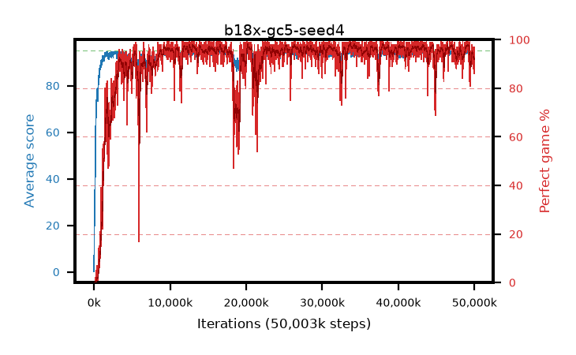

# b18x-gc5-seed4

step **50,003,968** · 3052 evals · trailing **93.85** · peak **94.59** @49,299,456 · sef **91.1** · best30 **97.7** @33,800,192

## Config

| | |
|---|---|
| algo | ppo |
| collect_envs | 128 |
| discount | 0.99 |
| eval_interval | 16384 |
| eval_queue | True |
| eval_queue_depth | 16 |
| eval_workers | 8 |
| fc_layers | (320,) |
| graph_eval_episodes | 100 |
| max_steps | 50003968 |
| min_checkpoint_score | 40.0 |
| ppo_adam_epsilon | 1e-07 |
| ppo_anneal_fraction | 1.0 |
| ppo_clip | 0.2 |
| ppo_clip_final | None |
| ppo_entropy_coef | 0.01 |
| ppo_entropy_coef_final | None |
| ppo_epochs | 4 |
| ppo_gae_lambda | 0.98 |
| ppo_gradient_clipping | 5.0 |
| ppo_horizon | 33.6 |
| ppo_learning_rate | 0.0003 |
| ppo_learning_rate_final | None |
| ppo_minibatch | 256 |
| ppo_normalize_adv | True |
| ppo_rollout | 128 |
| ppo_target_kl | 0.0 |
| ppo_transitions_per_rollout | 16384 |
| ppo_value_loss | huber |
| ppo_vf_coef | 0.5 |
| seed | 4 |
| torch_threads | 1 |

## Evals

| step | avg score | trailing avg | min score | max score | avg reward | perfect % | epsilon |
|---|---|---|---|---|---|---|---|
| 16384 | 0.19 | 0.19 | 0.0 | 2.0 | -0.672 | 0.0 |  |
| 32768 | 9.75 | 4.97 | 1.0 | 18.0 | 5.237 | 0.0 |  |
| 49152 | 23.62 | 11.19 | 8.0 | 43.0 | 18.584 | 0.0 |  |
| ... | ... | ... | ... | ... | ... | ... | ... |
| 49823744 | 93.23 | 93.58 | 16.0 | 95.0 | 185.967 | 94.0 |  |
| 49840128 | 94.27 | 93.63 | 82.0 | 95.0 | 184.996 | 92.0 |  |
| 49856512 | 94.31 | 93.61 | 75.0 | 95.0 | 188.048 | 95.0 |  |
| 49872896 | 94.77 | 93.62 | 80.0 | 95.0 | 190.489 | 97.0 |  |
| 49889280 | 93.95 | 93.63 | 61.0 | 95.0 | 183.685 | 91.0 |  |
| 49905664 | 93.88 | 93.6 | 78.0 | 95.0 | 180.614 | 88.0 |  |
| 49922048 | 92.69 | 93.81 | 14.0 | 95.0 | 180.425 | 89.0 |  |
| 49938432 | 94.38 | 93.71 | 77.0 | 95.0 | 189.103 | 96.0 |  |
| 49954816 | 94.01 | 93.84 | 68.0 | 95.0 | 185.744 | 93.0 |  |
| 49971200 | 92.27 | 93.81 | 20.0 | 95.0 | 177.016 | 86.0 |  |
| 49987584 | 92.69 | 93.79 | 8.0 | 95.0 | 182.417 | 91.0 |  |
| 50003968 | 94.16 | 93.85 | 30.0 | 95.0 | 189.884 | 97.0 |  |
