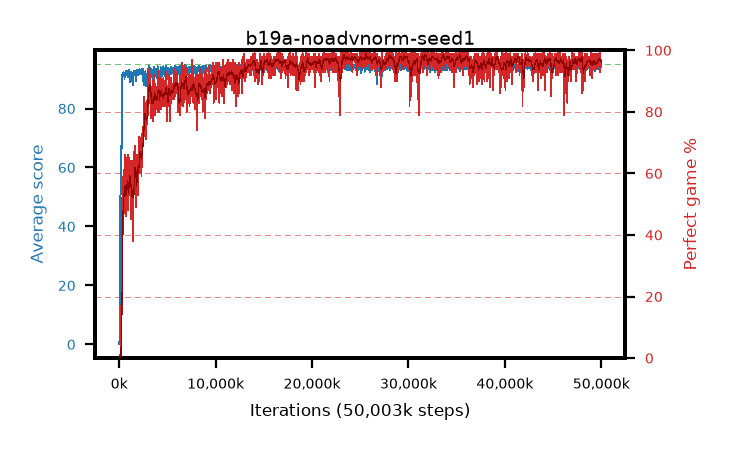

# b19a-noadvnorm-seed1

step **50,003,968** · 3052 evals · trailing **94.31** · peak **94.54** @23,691,264 · sef **94.1** · best30 **97.9** @25,673,728

## Config

| | |
|---|---|
| algo | ppo |
| collect_envs | 128 |
| discount | 0.99 |
| eval_interval | 16384 |
| eval_queue | True |
| eval_queue_depth | 16 |
| eval_workers | 8 |
| fc_layers | (320,) |
| graph_eval_episodes | 100 |
| max_steps | 50003968 |
| min_checkpoint_score | 40.0 |
| ppo_adam_epsilon | 1e-07 |
| ppo_anneal_fraction | 1.0 |
| ppo_clip | 0.2 |
| ppo_clip_final | None |
| ppo_entropy_coef | 0.01 |
| ppo_entropy_coef_final | None |
| ppo_epochs | 4 |
| ppo_gae_lambda | 0.98 |
| ppo_gradient_clipping | 0.5 |
| ppo_horizon | 33.6 |
| ppo_learning_rate | 0.0003 |
| ppo_learning_rate_final | None |
| ppo_minibatch | 256 |
| ppo_normalize_adv | False |
| ppo_rollout | 128 |
| ppo_target_kl | 0.0 |
| ppo_transitions_per_rollout | 16384 |
| ppo_value_loss | huber |
| ppo_vf_coef | 0.5 |
| seed | 1 |
| torch_threads | 1 |

## Evals

| step | avg score | trailing avg | min score | max score | avg reward | perfect % | epsilon |
|---|---|---|---|---|---|---|---|
| 16384 | 0.09 | 0.09 | 0.0 | 2.0 | -4.916 | 0.0 |  |
| 32768 | 1.74 | 0.92 | 0.0 | 8.0 | -0.86 | 0.0 |  |
| 49152 | 1.27 | 1.03 | 0.0 | 5.0 | 0.717 | 0.0 |  |
| ... | ... | ... | ... | ... | ... | ... | ... |
| 49823744 | 95.0 | 94.12 | 95.0 | 95.0 | 193.701 | 100.0 |  |
| 49840128 | 94.86 | 94.25 | 86.0 | 95.0 | 191.562 | 98.0 |  |
| 49856512 | 93.89 | 94.28 | 30.0 | 95.0 | 187.61 | 95.0 |  |
| 49872896 | 94.06 | 94.31 | 70.0 | 95.0 | 185.785 | 93.0 |  |
| 49889280 | 94.26 | 94.3 | 56.0 | 95.0 | 190.981 | 98.0 |  |
| 49905664 | 94.61 | 94.17 | 70.0 | 95.0 | 190.32 | 97.0 |  |
| 49922048 | 94.52 | 94.25 | 80.0 | 95.0 | 188.246 | 95.0 |  |
| 49938432 | 94.58 | 94.26 | 69.0 | 95.0 | 190.292 | 97.0 |  |
| 49954816 | 94.64 | 94.27 | 67.0 | 95.0 | 190.352 | 97.0 |  |
| 49971200 | 93.89 | 94.09 | 59.0 | 95.0 | 188.619 | 96.0 |  |
| 49987584 | 94.18 | 94.21 | 71.0 | 95.0 | 187.822 | 95.0 |  |
| 50003968 | 94.23 | 94.31 | 62.0 | 95.0 | 189.946 | 97.0 |  |
