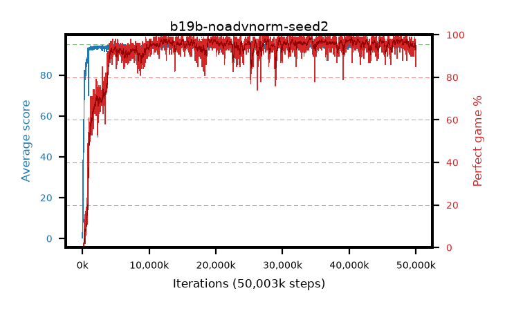

# b19b-noadvnorm-seed2

step **50,003,968** · 3052 evals · trailing **93.96** · peak **94.62** @34,357,248 · sef **92.5** · best30 **98.4** @34,373,632

## Config

| | |
|---|---|
| algo | ppo |
| collect_envs | 128 |
| discount | 0.99 |
| eval_interval | 16384 |
| eval_queue | True |
| eval_queue_depth | 16 |
| eval_workers | 8 |
| fc_layers | (320,) |
| graph_eval_episodes | 100 |
| max_steps | 50003968 |
| min_checkpoint_score | 40.0 |
| ppo_adam_epsilon | 1e-07 |
| ppo_anneal_fraction | 1.0 |
| ppo_clip | 0.2 |
| ppo_clip_final | None |
| ppo_entropy_coef | 0.01 |
| ppo_entropy_coef_final | None |
| ppo_epochs | 4 |
| ppo_gae_lambda | 0.98 |
| ppo_gradient_clipping | 0.5 |
| ppo_horizon | 33.6 |
| ppo_learning_rate | 0.0003 |
| ppo_learning_rate_final | None |
| ppo_minibatch | 256 |
| ppo_normalize_adv | False |
| ppo_rollout | 128 |
| ppo_target_kl | 0.0 |
| ppo_transitions_per_rollout | 16384 |
| ppo_value_loss | huber |
| ppo_vf_coef | 0.5 |
| seed | 2 |
| torch_threads | 1 |

## Evals

| step | avg score | trailing avg | min score | max score | avg reward | perfect % | epsilon |
|---|---|---|---|---|---|---|---|
| 16384 | 0.34 | 0.34 | 0.0 | 3.0 | -0.522 | 0.0 |  |
| 32768 | 6.24 | 3.29 | 2.0 | 19.0 | 1.232 | 0.0 |  |
| 49152 | 9.45 | 5.34 | 2.0 | 24.0 | 4.488 | 0.0 |  |
| ... | ... | ... | ... | ... | ... | ... | ... |
| 49823744 | 94.66 | 94.06 | 72.0 | 95.0 | 191.368 | 98.0 |  |
| 49840128 | 93.83 | 94.08 | 64.0 | 95.0 | 186.508 | 94.0 |  |
| 49856512 | 94.87 | 94.04 | 87.0 | 95.0 | 191.584 | 98.0 |  |
| 49872896 | 94.88 | 93.96 | 89.0 | 95.0 | 190.533 | 97.0 |  |
| 49889280 | 92.99 | 93.95 | 15.0 | 95.0 | 188.615 | 97.0 |  |
| 49905664 | 94.6 | 94.08 | 64.0 | 95.0 | 191.314 | 98.0 |  |
| 49922048 | 93.99 | 94.09 | 75.0 | 95.0 | 184.703 | 92.0 |  |
| 49938432 | 94.31 | 94.09 | 76.0 | 95.0 | 187.001 | 94.0 |  |
| 49954816 | 92.33 | 93.96 | 18.0 | 95.0 | 176.049 | 85.0 |  |
| 49971200 | 92.62 | 94.03 | 20.0 | 95.0 | 176.346 | 85.0 |  |
| 49987584 | 92.83 | 93.96 | 10.0 | 95.0 | 180.505 | 89.0 |  |
| 50003968 | 94.59 | 93.96 | 85.0 | 95.0 | 186.281 | 93.0 |  |
