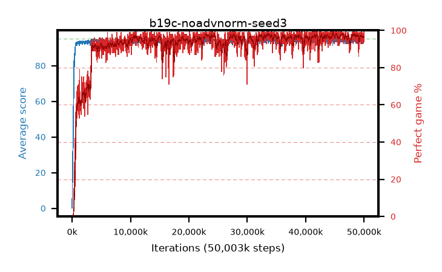

# b19c-noadvnorm-seed3

step **50,003,968** · 3052 evals · trailing **94.2** · peak **94.42** @45,596,672 · sef **93.1** · best30 **97.9** @46,366,720

## Config

| | |
|---|---|
| algo | ppo |
| collect_envs | 128 |
| discount | 0.99 |
| eval_interval | 16384 |
| eval_queue | True |
| eval_queue_depth | 16 |
| eval_workers | 8 |
| fc_layers | (320,) |
| graph_eval_episodes | 100 |
| max_steps | 50003968 |
| min_checkpoint_score | 40.0 |
| ppo_adam_epsilon | 1e-07 |
| ppo_anneal_fraction | 1.0 |
| ppo_clip | 0.2 |
| ppo_clip_final | None |
| ppo_entropy_coef | 0.01 |
| ppo_entropy_coef_final | None |
| ppo_epochs | 4 |
| ppo_gae_lambda | 0.98 |
| ppo_gradient_clipping | 0.5 |
| ppo_horizon | 33.6 |
| ppo_learning_rate | 0.0003 |
| ppo_learning_rate_final | None |
| ppo_minibatch | 256 |
| ppo_normalize_adv | False |
| ppo_rollout | 128 |
| ppo_target_kl | 0.0 |
| ppo_transitions_per_rollout | 16384 |
| ppo_value_loss | huber |
| ppo_vf_coef | 0.5 |
| seed | 3 |
| torch_threads | 1 |

## Evals

| step | avg score | trailing avg | min score | max score | avg reward | perfect % | epsilon |
|---|---|---|---|---|---|---|---|
| 16384 | 0.17 | 0.17 | 0.0 | 2.0 | -4.836 | 0.0 |  |
| 32768 | 10.43 | 5.3 | 0.0 | 27.0 | 6.446 | 0.0 |  |
| 49152 | 17.59 | 9.4 | 1.0 | 35.0 | 12.666 | 0.0 |  |
| ... | ... | ... | ... | ... | ... | ... | ... |
| 49823744 | 94.22 | 94.16 | 74.0 | 95.0 | 185.922 | 93.0 |  |
| 49840128 | 93.83 | 94.21 | 2.0 | 95.0 | 190.523 | 98.0 |  |
| 49856512 | 94.36 | 94.15 | 63.0 | 95.0 | 190.06 | 97.0 |  |
| 49872896 | 94.27 | 94.16 | 58.0 | 95.0 | 187.916 | 95.0 |  |
| 49889280 | 94.22 | 94.21 | 22.0 | 95.0 | 190.904 | 98.0 |  |
| 49905664 | 93.08 | 94.16 | 10.0 | 95.0 | 187.791 | 96.0 |  |
| 49922048 | 94.88 | 94.22 | 86.0 | 95.0 | 191.571 | 98.0 |  |
| 49938432 | 93.72 | 94.2 | 14.0 | 95.0 | 189.373 | 97.0 |  |
| 49954816 | 94.44 | 94.22 | 68.0 | 95.0 | 190.077 | 97.0 |  |
| 49971200 | 94.39 | 94.19 | 73.0 | 95.0 | 187.997 | 95.0 |  |
| 49987584 | 93.39 | 94.17 | 22.0 | 95.0 | 186.073 | 94.0 |  |
| 50003968 | 94.23 | 94.2 | 18.0 | 95.0 | 191.914 | 99.0 |  |
