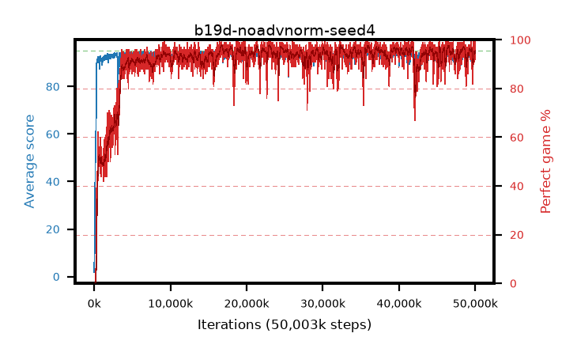

# b19d-noadvnorm-seed4

step **50,003,968** · 3052 evals · trailing **92.86** · peak **94.41** @23,117,824 · sef **92.7** · best30 **97.2** @23,150,592

## Config

| | |
|---|---|
| algo | ppo |
| collect_envs | 128 |
| discount | 0.99 |
| eval_interval | 16384 |
| eval_queue | True |
| eval_queue_depth | 16 |
| eval_workers | 8 |
| fc_layers | (320,) |
| graph_eval_episodes | 100 |
| max_steps | 50003968 |
| min_checkpoint_score | 40.0 |
| ppo_adam_epsilon | 1e-07 |
| ppo_anneal_fraction | 1.0 |
| ppo_clip | 0.2 |
| ppo_clip_final | None |
| ppo_entropy_coef | 0.01 |
| ppo_entropy_coef_final | None |
| ppo_epochs | 4 |
| ppo_gae_lambda | 0.98 |
| ppo_gradient_clipping | 0.5 |
| ppo_horizon | 33.6 |
| ppo_learning_rate | 0.0003 |
| ppo_learning_rate_final | None |
| ppo_minibatch | 256 |
| ppo_normalize_adv | False |
| ppo_rollout | 128 |
| ppo_target_kl | 0.0 |
| ppo_transitions_per_rollout | 16384 |
| ppo_value_loss | huber |
| ppo_vf_coef | 0.5 |
| seed | 4 |
| torch_threads | 1 |

## Evals

| step | avg score | trailing avg | min score | max score | avg reward | perfect % | epsilon |
|---|---|---|---|---|---|---|---|
| 16384 | 1.82 | 1.82 | 0.0 | 9.0 | 1.211 | 0.0 |  |
| 32768 | 8.69 | 5.25 | 0.0 | 20.0 | 4.123 | 0.0 |  |
| 49152 | 9.95 | 6.82 | 1.0 | 30.0 | 8.268 | 0.0 |  |
| ... | ... | ... | ... | ... | ... | ... | ... |
| 49823744 | 92.37 | 93.08 | 21.0 | 95.0 | 181.967 | 91.0 |  |
| 49840128 | 93.52 | 92.7 | 18.0 | 95.0 | 189.152 | 97.0 |  |
| 49856512 | 92.03 | 92.85 | 18.0 | 95.0 | 185.629 | 95.0 |  |
| 49872896 | 94.11 | 92.68 | 21.0 | 95.0 | 188.77 | 96.0 |  |
| 49889280 | 93.16 | 92.67 | 17.0 | 95.0 | 187.787 | 96.0 |  |
| 49905664 | 92.59 | 92.79 | 15.0 | 95.0 | 186.179 | 95.0 |  |
| 49922048 | 92.54 | 92.68 | 17.0 | 95.0 | 187.126 | 96.0 |  |
| 49938432 | 92.28 | 92.72 | 18.0 | 95.0 | 182.916 | 92.0 |  |
| 49954816 | 92.55 | 92.66 | 5.0 | 95.0 | 187.14 | 96.0 |  |
| 49971200 | 94.56 | 92.85 | 60.0 | 95.0 | 190.272 | 97.0 |  |
| 49987584 | 93.3 | 92.72 | 21.0 | 95.0 | 186.935 | 95.0 |  |
| 50003968 | 94.68 | 92.86 | 63.0 | 95.0 | 192.368 | 99.0 |  |
