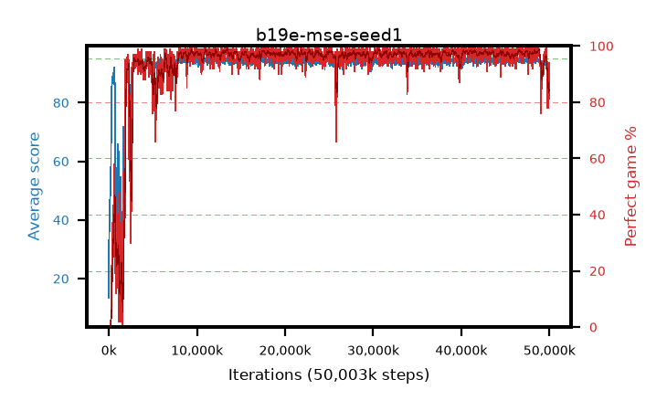

# b19e-mse-seed1

step **50,003,968** · 3052 evals · trailing **93.21** · peak **94.7** @9,175,040 · sef **95.3** · best30 **98.2** @13,516,800

## Config

| | |
|---|---|
| algo | ppo |
| collect_envs | 128 |
| discount | 0.99 |
| eval_interval | 16384 |
| eval_queue | True |
| eval_queue_depth | 16 |
| eval_workers | 8 |
| fc_layers | (320,) |
| graph_eval_episodes | 100 |
| max_steps | 50003968 |
| min_checkpoint_score | 40.0 |
| ppo_adam_epsilon | 1e-07 |
| ppo_anneal_fraction | 1.0 |
| ppo_clip | 0.2 |
| ppo_clip_final | None |
| ppo_entropy_coef | 0.01 |
| ppo_entropy_coef_final | None |
| ppo_epochs | 4 |
| ppo_gae_lambda | 0.98 |
| ppo_gradient_clipping | 0.5 |
| ppo_horizon | 33.6 |
| ppo_learning_rate | 0.0003 |
| ppo_learning_rate_final | None |
| ppo_minibatch | 256 |
| ppo_normalize_adv | True |
| ppo_rollout | 128 |
| ppo_target_kl | 0.0 |
| ppo_transitions_per_rollout | 16384 |
| ppo_value_loss | mse |
| ppo_vf_coef | 0.5 |
| seed | 1 |
| torch_threads | 1 |

## Evals

| step | avg score | trailing avg | min score | max score | avg reward | perfect % | epsilon |
|---|---|---|---|---|---|---|---|
| 16384 | 13.46 | 13.46 | 1.0 | 34.0 | 10.921 | 0.0 |  |
| 32768 | 46.5 | 38.91 | 19.0 | 86.0 | 41.575 | 0.0 |  |
| 49152 | 42.41 | 27.93 | 16.0 | 69.0 | 37.328 | 0.0 |  |
| ... | ... | ... | ... | ... | ... | ... | ... |
| 49823744 | 92.26 | 93.63 | 67.0 | 95.0 | 174.963 | 84.0 |  |
| 49840128 | 93.36 | 93.62 | 26.0 | 95.0 | 186.073 | 94.0 |  |
| 49856512 | 92.35 | 93.59 | 66.0 | 95.0 | 172.974 | 82.0 |  |
| 49872896 | 91.5 | 93.36 | 29.0 | 95.0 | 168.176 | 78.0 |  |
| 49889280 | 90.52 | 93.48 | 30.0 | 95.0 | 167.254 | 78.0 |  |
| 49905664 | 92.91 | 93.49 | 22.0 | 95.0 | 177.591 | 86.0 |  |
| 49922048 | 91.84 | 93.45 | 71.0 | 95.0 | 170.563 | 80.0 |  |
| 49938432 | 92.56 | 93.23 | 59.0 | 95.0 | 177.272 | 86.0 |  |
| 49954816 | 93.02 | 93.23 | 27.0 | 95.0 | 180.676 | 89.0 |  |
| 49971200 | 92.36 | 93.28 | 66.0 | 95.0 | 174.02 | 83.0 |  |
| 49987584 | 93.39 | 93.33 | 32.0 | 95.0 | 183.094 | 91.0 |  |
| 50003968 | 93.59 | 93.21 | 46.0 | 95.0 | 186.289 | 94.0 |  |
