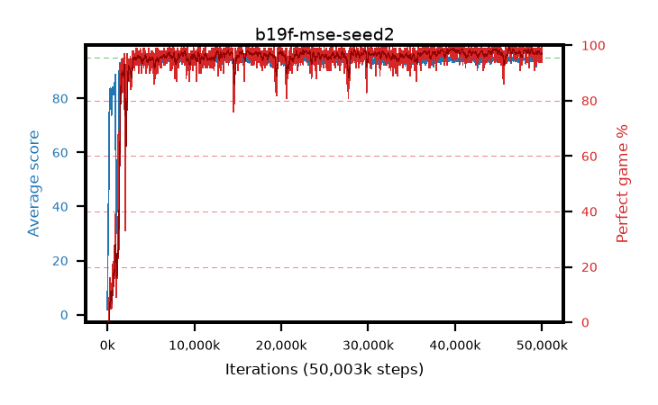

# b19f-mse-seed2

step **50,003,968** · 3052 evals · trailing **94.47** · peak **94.62** @39,780,352 · sef **96.7** · best30 **98.6** @39,878,656

## Config

| | |
|---|---|
| algo | ppo |
| collect_envs | 128 |
| discount | 0.99 |
| eval_interval | 16384 |
| eval_queue | True |
| eval_queue_depth | 16 |
| eval_workers | 8 |
| fc_layers | (320,) |
| graph_eval_episodes | 100 |
| max_steps | 50003968 |
| min_checkpoint_score | 40.0 |
| ppo_adam_epsilon | 1e-07 |
| ppo_anneal_fraction | 1.0 |
| ppo_clip | 0.2 |
| ppo_clip_final | None |
| ppo_entropy_coef | 0.01 |
| ppo_entropy_coef_final | None |
| ppo_epochs | 4 |
| ppo_gae_lambda | 0.98 |
| ppo_gradient_clipping | 0.5 |
| ppo_horizon | 33.6 |
| ppo_learning_rate | 0.0003 |
| ppo_learning_rate_final | None |
| ppo_minibatch | 256 |
| ppo_normalize_adv | True |
| ppo_rollout | 128 |
| ppo_target_kl | 0.0 |
| ppo_transitions_per_rollout | 16384 |
| ppo_value_loss | mse |
| ppo_vf_coef | 0.5 |
| seed | 2 |
| torch_threads | 1 |

## Evals

| step | avg score | trailing avg | min score | max score | avg reward | perfect % | epsilon |
|---|---|---|---|---|---|---|---|
| 16384 | 1.82 | 1.82 | 0.0 | 4.0 | -1.408 | 0.0 |  |
| 32768 | 17.03 | 17.79 | 7.0 | 32.0 | 12.45 | 0.0 |  |
| 49152 | 25.79 | 18.05 | 6.0 | 51.0 | 20.824 | 0.0 |  |
| ... | ... | ... | ... | ... | ... | ... | ... |
| 49823744 | 94.32 | 94.39 | 65.0 | 95.0 | 189.023 | 96.0 |  |
| 49840128 | 94.42 | 94.36 | 76.0 | 95.0 | 187.126 | 94.0 |  |
| 49856512 | 94.66 | 94.44 | 64.0 | 95.0 | 191.361 | 98.0 |  |
| 49872896 | 94.08 | 94.44 | 14.0 | 95.0 | 189.788 | 97.0 |  |
| 49889280 | 94.71 | 94.46 | 66.0 | 95.0 | 192.408 | 99.0 |  |
| 49905664 | 94.2 | 94.45 | 18.0 | 95.0 | 190.857 | 98.0 |  |
| 49922048 | 94.98 | 94.44 | 93.0 | 95.0 | 192.645 | 99.0 |  |
| 49938432 | 93.46 | 94.44 | 16.0 | 95.0 | 186.18 | 94.0 |  |
| 49954816 | 94.63 | 94.49 | 75.0 | 95.0 | 190.329 | 97.0 |  |
| 49971200 | 94.61 | 94.48 | 76.0 | 95.0 | 190.308 | 97.0 |  |
| 49987584 | 94.56 | 94.47 | 74.0 | 95.0 | 189.253 | 96.0 |  |
| 50003968 | 94.86 | 94.47 | 81.0 | 95.0 | 192.564 | 99.0 |  |
