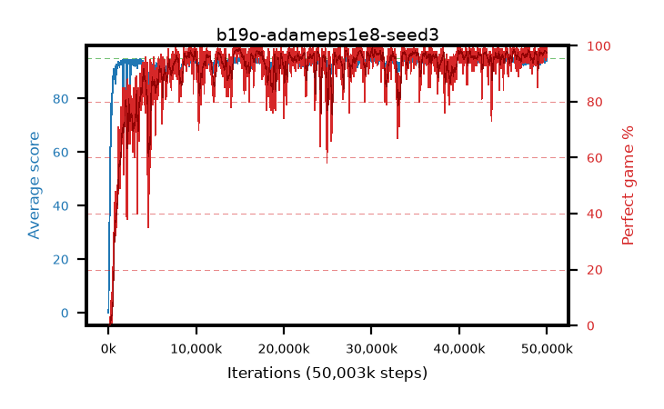

# b19o-adameps1e8-seed3

step **50,003,968** · 3052 evals · trailing **94.49** · peak **94.63** @14,958,592 · sef **91.5** · best30 **98.6** @14,974,976

## Config

| | |
|---|---|
| algo | ppo |
| collect_envs | 128 |
| discount | 0.99 |
| eval_interval | 16384 |
| eval_queue | True |
| eval_queue_depth | 16 |
| eval_workers | 8 |
| fc_layers | (320,) |
| graph_eval_episodes | 100 |
| max_steps | 50003968 |
| min_checkpoint_score | 40.0 |
| ppo_adam_epsilon | 1e-08 |
| ppo_anneal_fraction | 1.0 |
| ppo_clip | 0.2 |
| ppo_clip_final | None |
| ppo_entropy_coef | 0.01 |
| ppo_entropy_coef_final | None |
| ppo_epochs | 4 |
| ppo_gae_lambda | 0.98 |
| ppo_gradient_clipping | 0.5 |
| ppo_horizon | 33.6 |
| ppo_learning_rate | 0.0003 |
| ppo_learning_rate_final | None |
| ppo_minibatch | 256 |
| ppo_normalize_adv | True |
| ppo_rollout | 128 |
| ppo_target_kl | 0.0 |
| ppo_transitions_per_rollout | 16384 |
| ppo_value_loss | huber |
| ppo_vf_coef | 0.5 |
| seed | 3 |
| torch_threads | 1 |

## Evals

| step | avg score | trailing avg | min score | max score | avg reward | perfect % | epsilon |
|---|---|---|---|---|---|---|---|
| 16384 | 0.0 | 0.0 | 0.0 | 0.0 | -4.112 | 0.0 |  |
| 32768 | 2.19 | 1.09 | 1.0 | 10.0 | 1.575 | 0.0 |  |
| 49152 | 12.47 | 11.96 | 0.0 | 42.0 | 9.461 | 0.0 |  |
| ... | ... | ... | ... | ... | ... | ... | ... |
| 49823744 | 93.8 | 94.29 | 6.0 | 95.0 | 187.529 | 95.0 |  |
| 49840128 | 94.4 | 94.33 | 63.0 | 95.0 | 191.125 | 98.0 |  |
| 49856512 | 94.7 | 94.31 | 68.0 | 95.0 | 191.424 | 98.0 |  |
| 49872896 | 94.95 | 94.33 | 90.0 | 95.0 | 192.654 | 99.0 |  |
| 49889280 | 94.89 | 94.42 | 88.0 | 95.0 | 191.59 | 98.0 |  |
| 49905664 | 94.78 | 94.37 | 86.0 | 95.0 | 190.49 | 97.0 |  |
| 49922048 | 94.45 | 94.47 | 80.0 | 95.0 | 188.173 | 95.0 |  |
| 49938432 | 95.0 | 94.37 | 95.0 | 95.0 | 193.712 | 100.0 |  |
| 49954816 | 93.97 | 94.44 | 20.0 | 95.0 | 188.695 | 96.0 |  |
| 49971200 | 94.66 | 94.48 | 74.0 | 95.0 | 190.383 | 97.0 |  |
| 49987584 | 94.89 | 94.54 | 89.0 | 95.0 | 191.605 | 98.0 |  |
| 50003968 | 94.68 | 94.49 | 80.0 | 95.0 | 189.413 | 96.0 |  |
