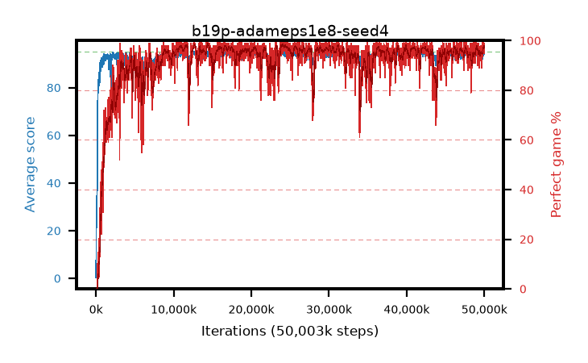

# b19p-adameps1e8-seed4

step **50,003,968** · 3052 evals · trailing **94.05** · peak **94.49** @41,009,152 · sef **91.7** · best30 **98.0** @24,363,008

## Config

| | |
|---|---|
| algo | ppo |
| collect_envs | 128 |
| discount | 0.99 |
| eval_interval | 16384 |
| eval_queue | True |
| eval_queue_depth | 16 |
| eval_workers | 8 |
| fc_layers | (320,) |
| graph_eval_episodes | 100 |
| max_steps | 50003968 |
| min_checkpoint_score | 40.0 |
| ppo_adam_epsilon | 1e-08 |
| ppo_anneal_fraction | 1.0 |
| ppo_clip | 0.2 |
| ppo_clip_final | None |
| ppo_entropy_coef | 0.01 |
| ppo_entropy_coef_final | None |
| ppo_epochs | 4 |
| ppo_gae_lambda | 0.98 |
| ppo_gradient_clipping | 0.5 |
| ppo_horizon | 33.6 |
| ppo_learning_rate | 0.0003 |
| ppo_learning_rate_final | None |
| ppo_minibatch | 256 |
| ppo_normalize_adv | True |
| ppo_rollout | 128 |
| ppo_target_kl | 0.0 |
| ppo_transitions_per_rollout | 16384 |
| ppo_value_loss | huber |
| ppo_vf_coef | 0.5 |
| seed | 4 |
| torch_threads | 1 |

## Evals

| step | avg score | trailing avg | min score | max score | avg reward | perfect % | epsilon |
|---|---|---|---|---|---|---|---|
| 16384 | 0.33 | 0.33 | 0.0 | 2.0 | -0.623 | 0.0 |  |
| 32768 | 16.49 | 13.94 | 1.0 | 34.0 | 11.954 | 0.0 |  |
| 49152 | 25.01 | 12.67 | 4.0 | 45.0 | 19.978 | 0.0 |  |
| ... | ... | ... | ... | ... | ... | ... | ... |
| 49823744 | 95.0 | 93.98 | 95.0 | 95.0 | 193.706 | 100.0 |  |
| 49840128 | 94.32 | 94.04 | 27.0 | 95.0 | 191.986 | 99.0 |  |
| 49856512 | 94.27 | 94.04 | 22.0 | 95.0 | 191.948 | 99.0 |  |
| 49872896 | 93.46 | 94.03 | 6.0 | 95.0 | 189.187 | 97.0 |  |
| 49889280 | 94.38 | 94.03 | 67.0 | 95.0 | 190.108 | 97.0 |  |
| 49905664 | 94.72 | 94.05 | 75.0 | 95.0 | 191.437 | 98.0 |  |
| 49922048 | 94.22 | 94.04 | 70.0 | 95.0 | 187.899 | 95.0 |  |
| 49938432 | 94.73 | 94.03 | 68.0 | 95.0 | 192.45 | 99.0 |  |
| 49954816 | 94.45 | 94.04 | 70.0 | 95.0 | 190.166 | 97.0 |  |
| 49971200 | 94.32 | 94.05 | 70.0 | 95.0 | 189.045 | 96.0 |  |
| 49987584 | 94.15 | 94.04 | 64.0 | 95.0 | 187.874 | 95.0 |  |
| 50003968 | 94.73 | 94.05 | 80.0 | 95.0 | 191.43 | 98.0 |  |
