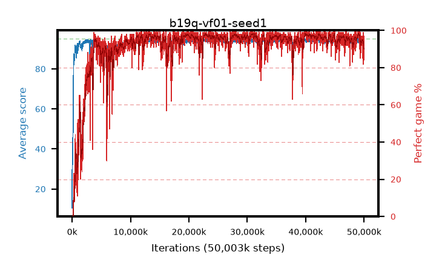

# b19q-vf01-seed1

step **50,003,968** · 3052 evals · trailing **94.06** · peak **94.56** @22,872,064 · sef **91.8** · best30 **97.9** @30,998,528

## Config

| | |
|---|---|
| algo | ppo |
| collect_envs | 128 |
| discount | 0.99 |
| eval_interval | 16384 |
| eval_queue | True |
| eval_queue_depth | 16 |
| eval_workers | 8 |
| fc_layers | (320,) |
| graph_eval_episodes | 100 |
| max_steps | 50003968 |
| min_checkpoint_score | 40.0 |
| ppo_adam_epsilon | 1e-07 |
| ppo_anneal_fraction | 1.0 |
| ppo_clip | 0.2 |
| ppo_clip_final | None |
| ppo_entropy_coef | 0.01 |
| ppo_entropy_coef_final | None |
| ppo_epochs | 4 |
| ppo_gae_lambda | 0.98 |
| ppo_gradient_clipping | 0.5 |
| ppo_horizon | 33.6 |
| ppo_learning_rate | 0.0003 |
| ppo_learning_rate_final | None |
| ppo_minibatch | 256 |
| ppo_normalize_adv | True |
| ppo_rollout | 128 |
| ppo_target_kl | 0.0 |
| ppo_transitions_per_rollout | 16384 |
| ppo_value_loss | huber |
| ppo_vf_coef | 0.1 |
| seed | 1 |
| torch_threads | 1 |

## Evals

| step | avg score | trailing avg | min score | max score | avg reward | perfect % | epsilon |
|---|---|---|---|---|---|---|---|
| 16384 | 10.51 | 21.37 | 2.0 | 31.0 | 9.186 | 0.0 |  |
| 32768 | 42.43 | 31.07 | 9.0 | 84.0 | 37.336 | 0.0 |  |
| 49152 | 34.5 | 25.75 | 11.0 | 82.0 | 29.468 | 0.0 |  |
| ... | ... | ... | ... | ... | ... | ... | ... |
| 49823744 | 94.95 | 94.05 | 90.0 | 95.0 | 192.579 | 99.0 |  |
| 49840128 | 93.06 | 94.04 | 10.0 | 95.0 | 183.776 | 92.0 |  |
| 49856512 | 93.87 | 94.05 | 34.0 | 95.0 | 184.58 | 92.0 |  |
| 49872896 | 92.28 | 93.92 | 42.0 | 95.0 | 172.979 | 82.0 |  |
| 49889280 | 93.95 | 93.97 | 70.0 | 95.0 | 183.669 | 91.0 |  |
| 49905664 | 94.43 | 93.97 | 75.0 | 95.0 | 189.133 | 96.0 |  |
| 49922048 | 93.68 | 93.97 | 79.0 | 95.0 | 178.402 | 86.0 |  |
| 49938432 | 93.4 | 93.92 | 32.0 | 95.0 | 180.13 | 88.0 |  |
| 49954816 | 92.98 | 94.05 | 18.0 | 95.0 | 175.709 | 84.0 |  |
| 49971200 | 94.61 | 93.98 | 83.0 | 95.0 | 188.311 | 95.0 |  |
| 49987584 | 94.53 | 94.09 | 80.0 | 95.0 | 187.23 | 94.0 |  |
| 50003968 | 94.75 | 94.06 | 79.0 | 95.0 | 190.462 | 97.0 |  |
