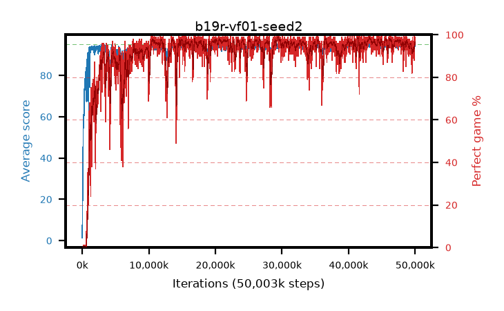

# b19r-vf01-seed2

step **50,003,968** · 3052 evals · trailing **93.95** · peak **94.58** @29,442,048 · sef **90.7** · best30 **98.3** @29,622,272

## Config

| | |
|---|---|
| algo | ppo |
| collect_envs | 128 |
| discount | 0.99 |
| eval_interval | 16384 |
| eval_queue | True |
| eval_queue_depth | 16 |
| eval_workers | 8 |
| fc_layers | (320,) |
| graph_eval_episodes | 100 |
| max_steps | 50003968 |
| min_checkpoint_score | 40.0 |
| ppo_adam_epsilon | 1e-07 |
| ppo_anneal_fraction | 1.0 |
| ppo_clip | 0.2 |
| ppo_clip_final | None |
| ppo_entropy_coef | 0.01 |
| ppo_entropy_coef_final | None |
| ppo_epochs | 4 |
| ppo_gae_lambda | 0.98 |
| ppo_gradient_clipping | 0.5 |
| ppo_horizon | 33.6 |
| ppo_learning_rate | 0.0003 |
| ppo_learning_rate_final | None |
| ppo_minibatch | 256 |
| ppo_normalize_adv | True |
| ppo_rollout | 128 |
| ppo_target_kl | 0.0 |
| ppo_transitions_per_rollout | 16384 |
| ppo_value_loss | huber |
| ppo_vf_coef | 0.1 |
| seed | 2 |
| torch_threads | 1 |

## Evals

| step | avg score | trailing avg | min score | max score | avg reward | perfect % | epsilon |
|---|---|---|---|---|---|---|---|
| 16384 | 1.36 | 1.36 | 0.0 | 5.0 | -0.977 | 0.0 |  |
| 32768 | 15.0 | 13.1 | 6.0 | 30.0 | 10.085 | 0.0 |  |
| 49152 | 22.93 | 12.14 | 6.0 | 53.0 | 17.895 | 0.0 |  |
| ... | ... | ... | ... | ... | ... | ... | ... |
| 49823744 | 92.66 | 93.82 | 10.0 | 95.0 | 179.376 | 88.0 |  |
| 49840128 | 94.27 | 93.81 | 64.0 | 95.0 | 188.98 | 96.0 |  |
| 49856512 | 94.67 | 93.8 | 62.0 | 95.0 | 192.378 | 99.0 |  |
| 49872896 | 94.92 | 93.87 | 87.0 | 95.0 | 192.625 | 99.0 |  |
| 49889280 | 94.67 | 93.85 | 76.0 | 95.0 | 190.394 | 97.0 |  |
| 49905664 | 92.95 | 93.83 | 20.0 | 95.0 | 183.677 | 92.0 |  |
| 49922048 | 93.53 | 93.82 | 16.0 | 95.0 | 188.204 | 96.0 |  |
| 49938432 | 94.69 | 93.92 | 84.0 | 95.0 | 188.339 | 95.0 |  |
| 49954816 | 94.85 | 93.9 | 86.0 | 95.0 | 191.55 | 98.0 |  |
| 49971200 | 94.8 | 93.85 | 75.0 | 95.0 | 192.487 | 99.0 |  |
| 49987584 | 94.26 | 93.9 | 30.0 | 95.0 | 189.918 | 97.0 |  |
| 50003968 | 94.25 | 93.95 | 50.0 | 95.0 | 188.864 | 96.0 |  |
