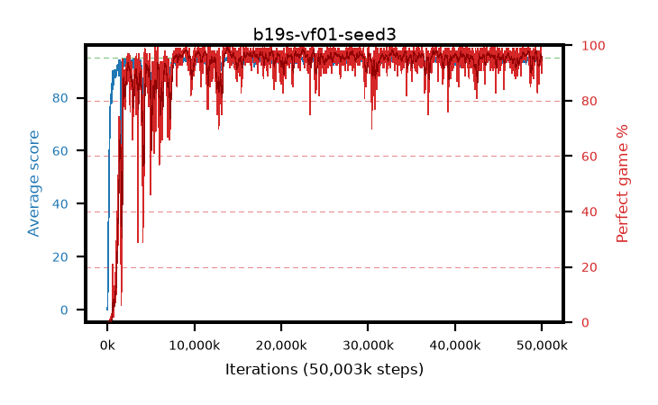

# b19s-vf01-seed3

step **50,003,968** · 3052 evals · trailing **93.99** · peak **94.56** @14,123,008 · sef **93.7** · best30 **98.3** @14,057,472

## Config

| | |
|---|---|
| algo | ppo |
| collect_envs | 128 |
| discount | 0.99 |
| eval_interval | 16384 |
| eval_queue | True |
| eval_queue_depth | 16 |
| eval_workers | 8 |
| fc_layers | (320,) |
| graph_eval_episodes | 100 |
| max_steps | 50003968 |
| min_checkpoint_score | 40.0 |
| ppo_adam_epsilon | 1e-07 |
| ppo_anneal_fraction | 1.0 |
| ppo_clip | 0.2 |
| ppo_clip_final | None |
| ppo_entropy_coef | 0.01 |
| ppo_entropy_coef_final | None |
| ppo_epochs | 4 |
| ppo_gae_lambda | 0.98 |
| ppo_gradient_clipping | 0.5 |
| ppo_horizon | 33.6 |
| ppo_learning_rate | 0.0003 |
| ppo_learning_rate_final | None |
| ppo_minibatch | 256 |
| ppo_normalize_adv | True |
| ppo_rollout | 128 |
| ppo_target_kl | 0.0 |
| ppo_transitions_per_rollout | 16384 |
| ppo_value_loss | huber |
| ppo_vf_coef | 0.1 |
| seed | 3 |
| torch_threads | 1 |

## Evals

| step | avg score | trailing avg | min score | max score | avg reward | perfect % | epsilon |
|---|---|---|---|---|---|---|---|
| 16384 | 0.03 | 0.03 | 0.0 | 1.0 | -0.565 | 0.0 |  |
| 32768 | 1.7 | 0.86 | 0.0 | 7.0 | 1.048 | 0.0 |  |
| 49152 | 10.13 | 3.95 | 0.0 | 29.0 | 6.166 | 0.0 |  |
| ... | ... | ... | ... | ... | ... | ... | ... |
| 49823744 | 94.91 | 93.96 | 86.0 | 95.0 | 192.602 | 99.0 |  |
| 49840128 | 94.23 | 93.98 | 18.0 | 95.0 | 191.953 | 99.0 |  |
| 49856512 | 93.81 | 93.96 | 67.0 | 95.0 | 187.54 | 95.0 |  |
| 49872896 | 93.77 | 93.96 | 56.0 | 95.0 | 185.451 | 93.0 |  |
| 49889280 | 94.6 | 93.96 | 55.0 | 95.0 | 192.317 | 99.0 |  |
| 49905664 | 94.96 | 93.98 | 91.0 | 95.0 | 192.662 | 99.0 |  |
| 49922048 | 94.59 | 93.95 | 70.0 | 95.0 | 189.299 | 96.0 |  |
| 49938432 | 94.63 | 93.98 | 76.0 | 95.0 | 189.299 | 96.0 |  |
| 49954816 | 93.13 | 93.97 | 18.0 | 95.0 | 181.85 | 90.0 |  |
| 49971200 | 93.29 | 94.04 | 10.0 | 95.0 | 184.023 | 92.0 |  |
| 49987584 | 93.84 | 94.04 | 46.0 | 95.0 | 185.486 | 93.0 |  |
| 50003968 | 93.17 | 93.99 | 28.0 | 95.0 | 183.8 | 92.0 |  |
