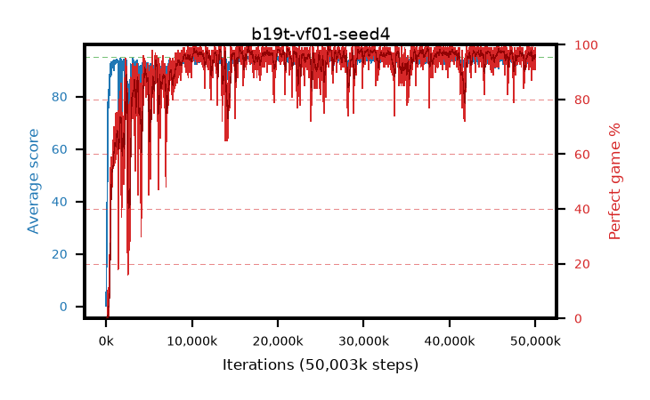

# b19t-vf01-seed4

step **50,003,968** · 3052 evals · trailing **94.05** · peak **94.63** @26,247,168 · sef **91.1** · best30 **98.2** @26,165,248

## Config

| | |
|---|---|
| algo | ppo |
| collect_envs | 128 |
| discount | 0.99 |
| eval_interval | 16384 |
| eval_queue | True |
| eval_queue_depth | 16 |
| eval_workers | 8 |
| fc_layers | (320,) |
| graph_eval_episodes | 100 |
| max_steps | 50003968 |
| min_checkpoint_score | 40.0 |
| ppo_adam_epsilon | 1e-07 |
| ppo_anneal_fraction | 1.0 |
| ppo_clip | 0.2 |
| ppo_clip_final | None |
| ppo_entropy_coef | 0.01 |
| ppo_entropy_coef_final | None |
| ppo_epochs | 4 |
| ppo_gae_lambda | 0.98 |
| ppo_gradient_clipping | 0.5 |
| ppo_horizon | 33.6 |
| ppo_learning_rate | 0.0003 |
| ppo_learning_rate_final | None |
| ppo_minibatch | 256 |
| ppo_normalize_adv | True |
| ppo_rollout | 128 |
| ppo_target_kl | 0.0 |
| ppo_transitions_per_rollout | 16384 |
| ppo_value_loss | huber |
| ppo_vf_coef | 0.1 |
| seed | 4 |
| torch_threads | 1 |

## Evals

| step | avg score | trailing avg | min score | max score | avg reward | perfect % | epsilon |
|---|---|---|---|---|---|---|---|
| 16384 | 0.15 | 0.15 | 0.0 | 2.0 | -0.669 | 0.0 |  |
| 32768 | 11.16 | 11.54 | 1.0 | 21.0 | 6.903 | 0.0 |  |
| 49152 | 23.31 | 11.73 | 3.0 | 40.0 | 18.277 | 0.0 |  |
| ... | ... | ... | ... | ... | ... | ... | ... |
| 49823744 | 94.4 | 93.92 | 44.0 | 95.0 | 191.065 | 98.0 |  |
| 49840128 | 94.01 | 93.9 | 42.0 | 95.0 | 189.673 | 97.0 |  |
| 49856512 | 94.6 | 93.95 | 73.0 | 95.0 | 191.296 | 98.0 |  |
| 49872896 | 93.03 | 94.04 | 2.0 | 95.0 | 186.709 | 95.0 |  |
| 49889280 | 92.95 | 93.99 | 20.0 | 95.0 | 183.609 | 92.0 |  |
| 49905664 | 94.15 | 93.93 | 60.0 | 95.0 | 189.842 | 97.0 |  |
| 49922048 | 93.67 | 93.95 | 28.0 | 95.0 | 186.378 | 94.0 |  |
| 49938432 | 94.23 | 93.93 | 56.0 | 95.0 | 188.833 | 96.0 |  |
| 49954816 | 93.86 | 93.93 | 8.0 | 95.0 | 188.568 | 96.0 |  |
| 49971200 | 94.85 | 93.93 | 80.0 | 95.0 | 192.54 | 99.0 |  |
| 49987584 | 92.33 | 93.84 | 20.0 | 95.0 | 182.007 | 91.0 |  |
| 50003968 | 94.09 | 94.05 | 24.0 | 95.0 | 190.797 | 98.0 |  |
