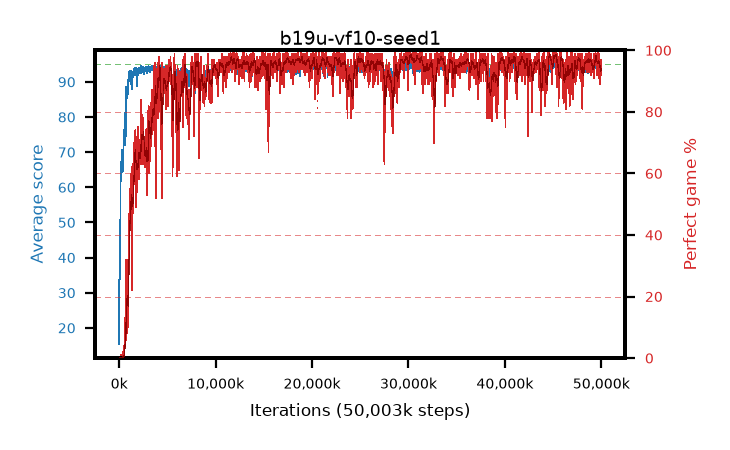

# b19u-vf10-seed1

step **50,003,968** · 3052 evals · trailing **94.02** · peak **94.53** @30,392,320 · sef **91.3** · best30 **97.7** @30,408,704

## Config

| | |
|---|---|
| algo | ppo |
| collect_envs | 128 |
| discount | 0.99 |
| eval_interval | 16384 |
| eval_queue | True |
| eval_queue_depth | 16 |
| eval_workers | 8 |
| fc_layers | (320,) |
| graph_eval_episodes | 100 |
| max_steps | 50003968 |
| min_checkpoint_score | 40.0 |
| ppo_adam_epsilon | 1e-07 |
| ppo_anneal_fraction | 1.0 |
| ppo_clip | 0.2 |
| ppo_clip_final | None |
| ppo_entropy_coef | 0.01 |
| ppo_entropy_coef_final | None |
| ppo_epochs | 4 |
| ppo_gae_lambda | 0.98 |
| ppo_gradient_clipping | 0.5 |
| ppo_horizon | 33.6 |
| ppo_learning_rate | 0.0003 |
| ppo_learning_rate_final | None |
| ppo_minibatch | 256 |
| ppo_normalize_adv | True |
| ppo_rollout | 128 |
| ppo_target_kl | 0.0 |
| ppo_transitions_per_rollout | 16384 |
| ppo_value_loss | huber |
| ppo_vf_coef | 1.0 |
| seed | 1 |
| torch_threads | 1 |

## Evals

| step | avg score | trailing avg | min score | max score | avg reward | perfect % | epsilon |
|---|---|---|---|---|---|---|---|
| 16384 | 15.39 | 25.12 | 3.0 | 39.0 | 13.641 | 0.0 |  |
| 32768 | 46.34 | 34.0 | 10.0 | 92.0 | 41.291 | 0.0 |  |
| 49152 | 34.84 | 34.84 | 10.0 | 70.0 | 29.759 | 0.0 |  |
| ... | ... | ... | ... | ... | ... | ... | ... |
| 49823744 | 94.29 | 94.39 | 73.0 | 95.0 | 187.994 | 95.0 |  |
| 49840128 | 93.65 | 94.34 | 20.0 | 95.0 | 188.334 | 96.0 |  |
| 49856512 | 93.84 | 94.32 | 18.0 | 95.0 | 189.56 | 97.0 |  |
| 49872896 | 92.7 | 94.11 | 8.0 | 95.0 | 183.386 | 92.0 |  |
| 49889280 | 92.81 | 94.24 | 12.0 | 95.0 | 180.533 | 89.0 |  |
| 49905664 | 93.69 | 94.3 | 65.0 | 95.0 | 185.404 | 93.0 |  |
| 49922048 | 94.07 | 94.22 | 70.0 | 95.0 | 187.777 | 95.0 |  |
| 49938432 | 94.19 | 94.2 | 54.0 | 95.0 | 188.916 | 96.0 |  |
| 49954816 | 93.09 | 94.01 | 56.0 | 95.0 | 183.821 | 92.0 |  |
| 49971200 | 92.59 | 94.04 | 6.0 | 95.0 | 186.328 | 95.0 |  |
| 49987584 | 94.7 | 94.03 | 76.0 | 95.0 | 190.406 | 97.0 |  |
| 50003968 | 94.03 | 94.02 | 57.0 | 95.0 | 187.752 | 95.0 |  |
