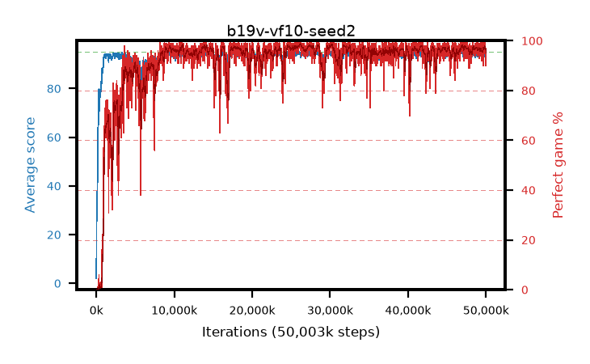

# b19v-vf10-seed2

step **50,003,968** · 3052 evals · trailing **94.35** · peak **94.6** @46,776,320 · sef **91.1** · best30 **98.2** @26,296,320

## Config

| | |
|---|---|
| algo | ppo |
| collect_envs | 128 |
| discount | 0.99 |
| eval_interval | 16384 |
| eval_queue | True |
| eval_queue_depth | 16 |
| eval_workers | 8 |
| fc_layers | (320,) |
| graph_eval_episodes | 100 |
| max_steps | 50003968 |
| min_checkpoint_score | 40.0 |
| ppo_adam_epsilon | 1e-07 |
| ppo_anneal_fraction | 1.0 |
| ppo_clip | 0.2 |
| ppo_clip_final | None |
| ppo_entropy_coef | 0.01 |
| ppo_entropy_coef_final | None |
| ppo_epochs | 4 |
| ppo_gae_lambda | 0.98 |
| ppo_gradient_clipping | 0.5 |
| ppo_horizon | 33.6 |
| ppo_learning_rate | 0.0003 |
| ppo_learning_rate_final | None |
| ppo_minibatch | 256 |
| ppo_normalize_adv | True |
| ppo_rollout | 128 |
| ppo_target_kl | 0.0 |
| ppo_transitions_per_rollout | 16384 |
| ppo_value_loss | huber |
| ppo_vf_coef | 1.0 |
| seed | 2 |
| torch_threads | 1 |

## Evals

| step | avg score | trailing avg | min score | max score | avg reward | perfect % | epsilon |
|---|---|---|---|---|---|---|---|
| 16384 | 2.04 | 2.04 | 0.0 | 6.0 | -0.967 | 0.0 |  |
| 32768 | 18.42 | 10.23 | 6.0 | 34.0 | 14.003 | 0.0 |  |
| 49152 | 30.06 | 22.31 | 4.0 | 64.0 | 25.357 | 0.0 |  |
| ... | ... | ... | ... | ... | ... | ... | ... |
| 49823744 | 94.9 | 94.37 | 90.0 | 95.0 | 190.604 | 97.0 |  |
| 49840128 | 95.0 | 94.4 | 95.0 | 95.0 | 193.698 | 100.0 |  |
| 49856512 | 92.94 | 94.31 | 8.0 | 95.0 | 186.625 | 95.0 |  |
| 49872896 | 94.34 | 94.42 | 44.0 | 95.0 | 191.012 | 98.0 |  |
| 49889280 | 94.91 | 94.43 | 86.0 | 95.0 | 192.604 | 99.0 |  |
| 49905664 | 94.76 | 94.34 | 82.0 | 95.0 | 189.465 | 96.0 |  |
| 49922048 | 93.08 | 94.36 | 23.0 | 95.0 | 187.671 | 96.0 |  |
| 49938432 | 94.56 | 94.35 | 72.0 | 95.0 | 190.263 | 97.0 |  |
| 49954816 | 94.24 | 94.35 | 74.0 | 95.0 | 184.945 | 92.0 |  |
| 49971200 | 93.95 | 94.37 | 24.0 | 95.0 | 188.647 | 96.0 |  |
| 49987584 | 94.25 | 94.39 | 69.0 | 95.0 | 184.96 | 92.0 |  |
| 50003968 | 93.86 | 94.35 | 62.0 | 95.0 | 182.568 | 90.0 |  |
