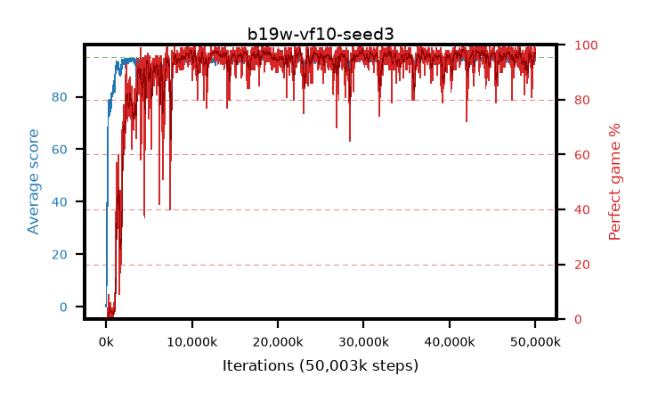

# b19w-vf10-seed3

step **50,003,968** · 3052 evals · trailing **93.87** · peak **94.56** @44,007,424 · sef **92.1** · best30 **97.8** @41,795,584

## Config

| | |
|---|---|
| algo | ppo |
| collect_envs | 128 |
| discount | 0.99 |
| eval_interval | 16384 |
| eval_queue | True |
| eval_queue_depth | 16 |
| eval_workers | 8 |
| fc_layers | (320,) |
| graph_eval_episodes | 100 |
| max_steps | 50003968 |
| min_checkpoint_score | 40.0 |
| ppo_adam_epsilon | 1e-07 |
| ppo_anneal_fraction | 1.0 |
| ppo_clip | 0.2 |
| ppo_clip_final | None |
| ppo_entropy_coef | 0.01 |
| ppo_entropy_coef_final | None |
| ppo_epochs | 4 |
| ppo_gae_lambda | 0.98 |
| ppo_gradient_clipping | 0.5 |
| ppo_horizon | 33.6 |
| ppo_learning_rate | 0.0003 |
| ppo_learning_rate_final | None |
| ppo_minibatch | 256 |
| ppo_normalize_adv | True |
| ppo_rollout | 128 |
| ppo_target_kl | 0.0 |
| ppo_transitions_per_rollout | 16384 |
| ppo_value_loss | huber |
| ppo_vf_coef | 1.0 |
| seed | 3 |
| torch_threads | 1 |

## Evals

| step | avg score | trailing avg | min score | max score | avg reward | perfect % | epsilon |
|---|---|---|---|---|---|---|---|
| 16384 | 0.04 | 0.04 | 0.0 | 1.0 | -3.048 | 0.0 |  |
| 32768 | 1.54 | 0.79 | 0.0 | 8.0 | 0.98 | 0.0 |  |
| 49152 | 14.36 | 5.31 | 0.0 | 32.0 | 10.737 | 0.0 |  |
| ... | ... | ... | ... | ... | ... | ... | ... |
| 49823744 | 94.19 | 93.71 | 73.0 | 95.0 | 185.898 | 93.0 |  |
| 49840128 | 93.9 | 93.83 | 12.0 | 95.0 | 188.567 | 96.0 |  |
| 49856512 | 94.65 | 93.84 | 62.0 | 95.0 | 191.336 | 98.0 |  |
| 49872896 | 94.23 | 93.87 | 71.0 | 95.0 | 185.959 | 93.0 |  |
| 49889280 | 95.0 | 93.9 | 95.0 | 95.0 | 193.716 | 100.0 |  |
| 49905664 | 94.9 | 93.84 | 85.0 | 95.0 | 192.608 | 99.0 |  |
| 49922048 | 93.34 | 93.71 | 30.0 | 95.0 | 187.992 | 96.0 |  |
| 49938432 | 94.49 | 93.73 | 44.0 | 95.0 | 192.17 | 99.0 |  |
| 49954816 | 94.12 | 93.84 | 18.0 | 95.0 | 190.787 | 98.0 |  |
| 49971200 | 93.95 | 93.81 | 8.0 | 95.0 | 189.656 | 97.0 |  |
| 49987584 | 93.68 | 93.77 | 10.0 | 95.0 | 188.401 | 96.0 |  |
| 50003968 | 94.68 | 93.87 | 81.0 | 95.0 | 189.39 | 96.0 |  |
