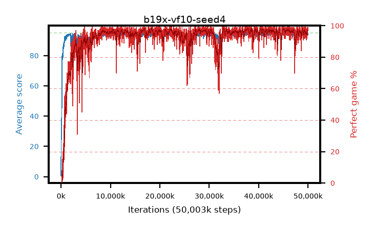

# b19x-vf10-seed4

step **50,003,968** · 3052 evals · trailing **94.06** · peak **94.62** @45,219,840 · sef **92.8** · best30 **97.8** @37,797,888

## Config

| | |
|---|---|
| algo | ppo |
| collect_envs | 128 |
| discount | 0.99 |
| eval_interval | 16384 |
| eval_queue | True |
| eval_queue_depth | 16 |
| eval_workers | 8 |
| fc_layers | (320,) |
| graph_eval_episodes | 100 |
| max_steps | 50003968 |
| min_checkpoint_score | 40.0 |
| ppo_adam_epsilon | 1e-07 |
| ppo_anneal_fraction | 1.0 |
| ppo_clip | 0.2 |
| ppo_clip_final | None |
| ppo_entropy_coef | 0.01 |
| ppo_entropy_coef_final | None |
| ppo_epochs | 4 |
| ppo_gae_lambda | 0.98 |
| ppo_gradient_clipping | 0.5 |
| ppo_horizon | 33.6 |
| ppo_learning_rate | 0.0003 |
| ppo_learning_rate_final | None |
| ppo_minibatch | 256 |
| ppo_normalize_adv | True |
| ppo_rollout | 128 |
| ppo_target_kl | 0.0 |
| ppo_transitions_per_rollout | 16384 |
| ppo_value_loss | huber |
| ppo_vf_coef | 1.0 |
| seed | 4 |
| torch_threads | 1 |

## Evals

| step | avg score | trailing avg | min score | max score | avg reward | perfect % | epsilon |
|---|---|---|---|---|---|---|---|
| 16384 | 0.5 | 0.5 | 0.0 | 3.0 | -0.726 | 0.0 |  |
| 32768 | 21.87 | 20.55 | 2.0 | 42.0 | 16.964 | 0.0 |  |
| 49152 | 25.69 | 13.1 | 5.0 | 41.0 | 20.658 | 0.0 |  |
| ... | ... | ... | ... | ... | ... | ... | ... |
| 49823744 | 94.75 | 94.01 | 70.0 | 95.0 | 192.466 | 99.0 |  |
| 49840128 | 94.13 | 94.01 | 38.0 | 95.0 | 188.851 | 96.0 |  |
| 49856512 | 93.37 | 94.03 | 4.0 | 95.0 | 189.09 | 97.0 |  |
| 49872896 | 93.75 | 94.0 | 24.0 | 95.0 | 189.419 | 97.0 |  |
| 49889280 | 94.45 | 94.03 | 77.0 | 95.0 | 187.155 | 94.0 |  |
| 49905664 | 94.76 | 94.04 | 78.0 | 95.0 | 190.47 | 97.0 |  |
| 49922048 | 94.9 | 94.06 | 85.0 | 95.0 | 192.613 | 99.0 |  |
| 49938432 | 94.02 | 94.06 | 18.0 | 95.0 | 190.725 | 98.0 |  |
| 49954816 | 94.9 | 94.05 | 85.0 | 95.0 | 192.607 | 99.0 |  |
| 49971200 | 93.88 | 94.02 | 26.0 | 95.0 | 189.557 | 97.0 |  |
| 49987584 | 94.11 | 94.04 | 6.0 | 95.0 | 191.835 | 99.0 |  |
| 50003968 | 93.97 | 94.06 | 22.0 | 95.0 | 189.689 | 97.0 |  |
