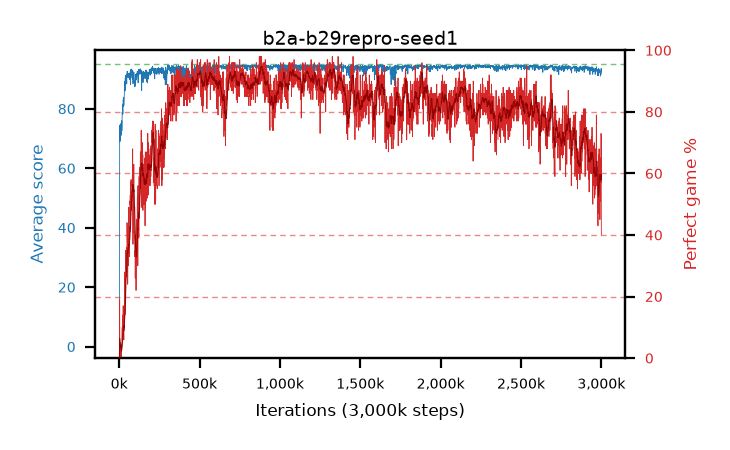

# b2a-b29repro-seed1

step **3,000,000** · 3000 evals · trailing **92.5** · peak **94.53** @777,000 · sef **66.2** · best30 **93.6** @898,000

## Config

| | |
|---|---|
| adam_epsilon | 1e-07 |
| algo | dqn |
| batch_size | 128 |
| beta_anneal_steps | 300000 |
| collect_envs | 1 |
| discount | 0.9975 |
| eval_interval | 1000 |
| fc_layers | (320,) |
| fork_branches | 4 |
| fork_max_steps | 60 |
| fork_min_length | 85 |
| fork_prob | 0.5 |
| gradient_clipping | 0.0 |
| graph_eval_episodes | 100 |
| guided_fraction | 0.8 |
| initial_collect_steps | 2000 |
| initial_epsilon | 0.4 |
| is_beta | 0.4 |
| is_beta_final | 1.0 |
| is_weights | False |
| learning_rate | 1e-05 |
| max_steps | 3000000 |
| min_checkpoint_score | 40.0 |
| min_epsilon | 0.002 |
| n_step_update | 1 |
| priority_exponent | 0.6 |
| replay_buffer_max_length | 100000 |
| replay_ratio | 1.0 |
| seed | 1 |
| target_update_period | 1000 |
| target_update_tau | 1.0 |
| torch_threads | 1 |

## Evals

| step | avg score | trailing avg | min score | max score | avg reward | perfect % | epsilon |
|---|---|---|---|---|---|---|---|
| 1000 | 0.85 | 0.85 | 0.0 | 7.0 | 0.35 | 0.0 | 0.4 |
| 2000 | 1.73 | 1.29 | 0.0 | 8.0 | 1.23 | 0.0 | 0.4 |
| 3000 | 70.58 | 24.39 | 1.0 | 95.0 | 88.985 | 19.0 | 0.01081 |
| ... | ... | ... | ... | ... | ... | ... | ... |
| 2989000 | 92.73 | 92.76 | 71.0 | 95.0 | 152.21 | 62.0 | 0.00323 |
| 2990000 | 92.25 | 92.74 | 60.0 | 95.0 | 143.41 | 54.0 | 0.00323 |
| 2991000 | 92.55 | 92.74 | 74.0 | 95.0 | 134.35 | 45.0 | 0.00326 |
| 2992000 | 92.05 | 92.75 | 68.0 | 95.0 | 148.41 | 59.0 | 0.00325 |
| 2993000 | 92.14 | 92.71 | 70.0 | 95.0 | 149.585 | 60.0 | 0.00327 |
| 2994000 | 91.01 | 92.64 | 20.0 | 95.0 | 139.095 | 51.0 | 0.00331 |
| 2995000 | 92.67 | 92.64 | 60.0 | 95.0 | 155.27 | 65.0 | 0.00329 |
| 2996000 | 92.31 | 92.6 | 64.0 | 95.0 | 149.71 | 60.0 | 0.00329 |
| 2997000 | 92.57 | 92.57 | 69.0 | 95.0 | 146.85 | 57.0 | 0.00329 |
| 2998000 | 93.11 | 92.58 | 8.0 | 95.0 | 164.075 | 73.0 | 0.00327 |
| 2999000 | 93.6 | 92.56 | 62.0 | 95.0 | 163.48 | 72.0 | 0.00329 |
| 3000000 | 91.69 | 92.5 | 36.0 | 95.0 | 128.29 | 40.0 | 0.00334 |
