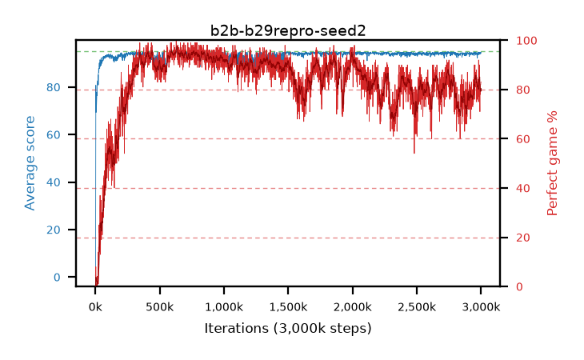

# b2b-b29repro-seed2

step **3,000,000** · 3000 evals · trailing **94.29** · peak **94.59** @2,005,000 · sef **74.4** · best30 **95.8** @645,000

## Config

| | |
|---|---|
| adam_epsilon | 1e-07 |
| algo | dqn |
| batch_size | 128 |
| beta_anneal_steps | 300000 |
| collect_envs | 1 |
| discount | 0.9975 |
| eval_interval | 1000 |
| fc_layers | (320,) |
| fork_branches | 4 |
| fork_max_steps | 60 |
| fork_min_length | 85 |
| fork_prob | 0.5 |
| gradient_clipping | 0.0 |
| graph_eval_episodes | 100 |
| guided_fraction | 0.8 |
| initial_collect_steps | 2000 |
| initial_epsilon | 0.4 |
| is_beta | 0.4 |
| is_beta_final | 1.0 |
| is_weights | False |
| learning_rate | 1e-05 |
| max_steps | 3000000 |
| min_checkpoint_score | 40.0 |
| min_epsilon | 0.002 |
| n_step_update | 1 |
| priority_exponent | 0.6 |
| replay_buffer_max_length | 100000 |
| replay_ratio | 1.0 |
| seed | 2 |
| target_update_period | 1000 |
| target_update_tau | 1.0 |
| torch_threads | 1 |

## Evals

| step | avg score | trailing avg | min score | max score | avg reward | perfect % | epsilon |
|---|---|---|---|---|---|---|---|
| 1000 | 0.73 | 0.73 | 0.0 | 3.0 | 0.23 | 0.0 | 0.4 |
| 2000 | 1.39 | 1.06 | 0.0 | 6.0 | 0.89 | 0.0 | 0.4 |
| 3000 | 49.15 | 17.09 | 1.0 | 95.0 | 55.615 | 7.0 | 0.025 |
| ... | ... | ... | ... | ... | ... | ... | ... |
| 2989000 | 94.59 | 94.08 | 90.0 | 95.0 | 172.835 | 80.0 | 0.002 |
| 2990000 | 94.24 | 94.09 | 84.0 | 95.0 | 167.42 | 75.0 | 0.002 |
| 2991000 | 93.91 | 94.08 | 48.0 | 95.0 | 162.885 | 71.0 | 0.002 |
| 2992000 | 94.37 | 94.1 | 70.0 | 95.0 | 172.615 | 80.0 | 0.002 |
| 2993000 | 94.72 | 94.13 | 92.0 | 95.0 | 170.885 | 78.0 | 0.002 |
| 2994000 | 94.61 | 94.13 | 88.0 | 95.0 | 172.81 | 80.0 | 0.002 |
| 2995000 | 94.47 | 94.14 | 82.0 | 95.0 | 174.795 | 82.0 | 0.002 |
| 2996000 | 94.56 | 94.16 | 88.0 | 95.0 | 174.975 | 82.0 | 0.002 |
| 2997000 | 94.04 | 94.17 | 31.0 | 95.0 | 174.41 | 82.0 | 0.002 |
| 2998000 | 94.64 | 94.2 | 84.0 | 95.0 | 176.005 | 83.0 | 0.002 |
| 2999000 | 94.64 | 94.25 | 89.0 | 95.0 | 176.095 | 83.0 | 0.002 |
| 3000000 | 94.67 | 94.29 | 82.0 | 95.0 | 176.035 | 83.0 | 0.002 |
