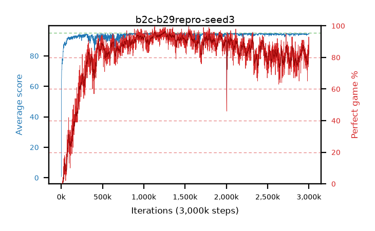

# b2c-b29repro-seed3

step **3,000,000** · 3000 evals · trailing **94.22** · peak **94.68** @1,257,000 · sef **76.3** · best30 **95.9** @1,262,000

## Config

| | |
|---|---|
| adam_epsilon | 1e-07 |
| algo | dqn |
| batch_size | 128 |
| beta_anneal_steps | 300000 |
| collect_envs | 1 |
| discount | 0.9975 |
| eval_interval | 1000 |
| fc_layers | (320,) |
| fork_branches | 4 |
| fork_max_steps | 60 |
| fork_min_length | 85 |
| fork_prob | 0.5 |
| gradient_clipping | 0.0 |
| graph_eval_episodes | 100 |
| guided_fraction | 0.8 |
| initial_collect_steps | 2000 |
| initial_epsilon | 0.4 |
| is_beta | 0.4 |
| is_beta_final | 1.0 |
| is_weights | False |
| learning_rate | 1e-05 |
| max_steps | 3000000 |
| min_checkpoint_score | 40.0 |
| min_epsilon | 0.002 |
| n_step_update | 1 |
| priority_exponent | 0.6 |
| replay_buffer_max_length | 100000 |
| replay_ratio | 1.0 |
| seed | 3 |
| target_update_period | 1000 |
| target_update_tau | 1.0 |
| torch_threads | 1 |

## Evals

| step | avg score | trailing avg | min score | max score | avg reward | perfect % | epsilon |
|---|---|---|---|---|---|---|---|
| 1000 | 0.72 | 0.72 | 0.0 | 5.0 | 0.22 | 0.0 | 0.4 |
| 2000 | 1.43 | 1.07 | 0.0 | 6.0 | 0.93 | 0.0 | 0.4 |
| 3000 | 64.3 | 22.15 | 1.0 | 92.0 | 63.8 | 0.0 | 0.0125 |
| ... | ... | ... | ... | ... | ... | ... | ... |
| 2989000 | 94.36 | 94.16 | 82.0 | 95.0 | 179.885 | 87.0 | 0.0021 |
| 2990000 | 94.09 | 94.17 | 82.0 | 95.0 | 171.295 | 79.0 | 0.00209 |
| 2991000 | 94.17 | 94.16 | 65.0 | 95.0 | 180.69 | 88.0 | 0.00208 |
| 2992000 | 94.51 | 94.18 | 86.0 | 95.0 | 175.83 | 83.0 | 0.00207 |
| 2993000 | 94.34 | 94.19 | 84.0 | 95.0 | 175.66 | 83.0 | 0.00207 |
| 2994000 | 94.24 | 94.2 | 83.0 | 95.0 | 166.2 | 74.0 | 0.00209 |
| 2995000 | 94.35 | 94.2 | 83.0 | 95.0 | 176.71 | 84.0 | 0.00207 |
| 2996000 | 94.57 | 94.2 | 84.0 | 95.0 | 180.095 | 87.0 | 0.00207 |
| 2997000 | 94.5 | 94.21 | 87.0 | 95.0 | 173.74 | 81.0 | 0.00206 |
| 2998000 | 94.76 | 94.22 | 84.0 | 95.0 | 186.48 | 93.0 | 0.00203 |
| 2999000 | 94.59 | 94.24 | 85.0 | 95.0 | 180.07 | 87.0 | 0.00202 |
| 3000000 | 94.13 | 94.22 | 80.0 | 95.0 | 175.45 | 83.0 | 0.00201 |
