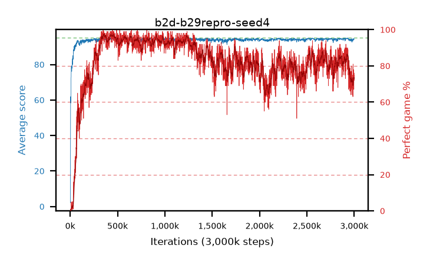

# b2d-b29repro-seed4

step **3,000,000** · 3000 evals · trailing **93.97** · peak **94.71** @1,079,000 · sef **68.3** · best30 **96.9** @450,000

## Config

| | |
|---|---|
| adam_epsilon | 1e-07 |
| algo | dqn |
| batch_size | 128 |
| beta_anneal_steps | 300000 |
| collect_envs | 1 |
| discount | 0.9975 |
| eval_interval | 1000 |
| fc_layers | (320,) |
| fork_branches | 4 |
| fork_max_steps | 60 |
| fork_min_length | 85 |
| fork_prob | 0.5 |
| gradient_clipping | 0.0 |
| graph_eval_episodes | 100 |
| guided_fraction | 0.8 |
| initial_collect_steps | 2000 |
| initial_epsilon | 0.4 |
| is_beta | 0.4 |
| is_beta_final | 1.0 |
| is_weights | False |
| learning_rate | 1e-05 |
| max_steps | 3000000 |
| min_checkpoint_score | 40.0 |
| min_epsilon | 0.002 |
| n_step_update | 1 |
| priority_exponent | 0.6 |
| replay_buffer_max_length | 100000 |
| replay_ratio | 1.0 |
| seed | 4 |
| target_update_period | 1000 |
| target_update_tau | 1.0 |
| torch_threads | 1 |

## Evals

| step | avg score | trailing avg | min score | max score | avg reward | perfect % | epsilon |
|---|---|---|---|---|---|---|---|
| 1000 | 2.18 | 2.18 | 0.0 | 8.0 | 1.68 | 0.0 | 0.4 |
| 2000 | 2.3 | 2.24 | 0.0 | 11.0 | 1.8 | 0.0 | 0.4 |
| 3000 | 28.57 | 11.02 | 1.0 | 95.0 | 29.065 | 1.0 | 0.05 |
| ... | ... | ... | ... | ... | ... | ... | ... |
| 2989000 | 94.51 | 93.86 | 89.0 | 95.0 | 173.795 | 81.0 | 0.00241 |
| 2990000 | 94.04 | 93.86 | 81.0 | 95.0 | 163.105 | 71.0 | 0.00242 |
| 2991000 | 94.15 | 93.87 | 82.0 | 95.0 | 163.08 | 71.0 | 0.00242 |
| 2992000 | 94.54 | 93.89 | 91.0 | 95.0 | 170.66 | 78.0 | 0.00241 |
| 2993000 | 94.3 | 93.89 | 86.0 | 95.0 | 169.38 | 77.0 | 0.00241 |
| 2994000 | 94.42 | 93.91 | 90.0 | 95.0 | 166.47 | 74.0 | 0.00239 |
| 2995000 | 94.25 | 93.92 | 81.0 | 95.0 | 162.095 | 70.0 | 0.0024 |
| 2996000 | 93.85 | 93.94 | 78.0 | 95.0 | 158.53 | 67.0 | 0.0024 |
| 2997000 | 94.33 | 93.95 | 80.0 | 95.0 | 167.33 | 75.0 | 0.00239 |
| 2998000 | 94.29 | 93.95 | 88.0 | 95.0 | 164.26 | 72.0 | 0.00239 |
| 2999000 | 94.33 | 93.95 | 86.0 | 95.0 | 166.425 | 74.0 | 0.0024 |
| 3000000 | 94.48 | 93.97 | 91.0 | 95.0 | 168.52 | 76.0 | 0.0024 |
