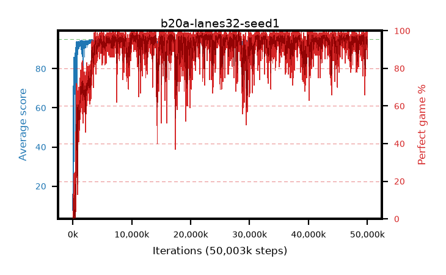

# b20a-lanes32-seed1

step **50,003,968** · 12208 evals · trailing **94.29** · peak **94.61** @10,854,400 · sef **88.9** · best30 **98.1** @21,192,704

## Config

| | |
|---|---|
| algo | ppo |
| collect_envs | 32 |
| discount | 0.99 |
| eval_interval | 4096 |
| eval_queue | True |
| eval_queue_depth | 16 |
| eval_workers | 8 |
| fc_layers | (320,) |
| graph_eval_episodes | 100 |
| max_steps | 50003968 |
| min_checkpoint_score | 40.0 |
| ppo_adam_epsilon | 1e-07 |
| ppo_anneal_fraction | 1.0 |
| ppo_clip | 0.2 |
| ppo_clip_final | None |
| ppo_entropy_coef | 0.01 |
| ppo_entropy_coef_final | None |
| ppo_epochs | 4 |
| ppo_gae_lambda | 0.98 |
| ppo_gradient_clipping | 0.5 |
| ppo_horizon | 33.6 |
| ppo_learning_rate | 0.0003 |
| ppo_learning_rate_final | None |
| ppo_minibatch | 256 |
| ppo_normalize_adv | True |
| ppo_rollout | 128 |
| ppo_target_kl | 0.0 |
| ppo_transitions_per_rollout | 4096 |
| ppo_value_loss | huber |
| ppo_vf_coef | 0.5 |
| seed | 1 |
| torch_threads | 1 |

## Evals

| step | avg score | trailing avg | min score | max score | avg reward | perfect % | epsilon |
|---|---|---|---|---|---|---|---|
| 4096 | 7.66 | 21.36 | 0.0 | 31.0 | 6.732 | 0.0 |  |
| 8192 | 16.57 | 16.57 | 4.0 | 29.0 | 11.551 | 0.0 |  |
| 12288 | 20.55 | 19.95 | 4.0 | 37.0 | 15.527 | 0.0 |  |
| ... | ... | ... | ... | ... | ... | ... | ... |
| 49958912 | 94.34 | 94.39 | 76.0 | 95.0 | 185.023 | 92.0 |  |
| 49963008 | 93.78 | 94.38 | 26.0 | 95.0 | 184.455 | 92.0 |  |
| 49967104 | 94.66 | 94.39 | 80.0 | 95.0 | 190.322 | 97.0 |  |
| 49971200 | 92.62 | 94.3 | 18.0 | 95.0 | 182.258 | 91.0 |  |
| 49975296 | 93.76 | 94.34 | 75.0 | 95.0 | 181.433 | 89.0 |  |
| 49979392 | 94.47 | 94.36 | 80.0 | 95.0 | 186.086 | 93.0 |  |
| 49983488 | 93.78 | 94.37 | 79.0 | 95.0 | 180.446 | 88.0 |  |
| 49987584 | 93.41 | 94.27 | 76.0 | 95.0 | 177.073 | 85.0 |  |
| 49991680 | 94.24 | 94.35 | 79.0 | 95.0 | 184.911 | 92.0 |  |
| 49995776 | 94.23 | 94.39 | 61.0 | 95.0 | 184.821 | 92.0 |  |
| 49999872 | 94.67 | 94.3 | 80.0 | 95.0 | 187.327 | 94.0 |  |
| 50003968 | 94.41 | 94.29 | 75.0 | 95.0 | 186.076 | 93.0 |  |
