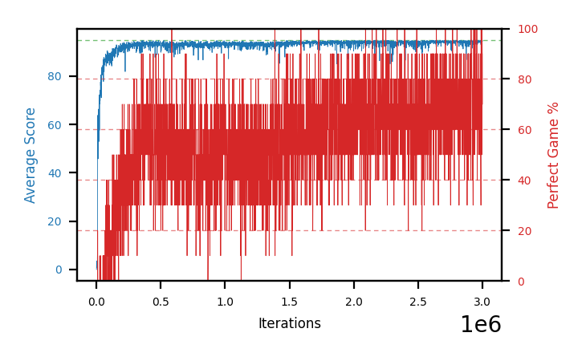

# b20aa-fc93x93seed1

Blue is average score (food eaten) on the left axis, red is perfect-game percentage on the right.

Latest eval: step 3000000, avg score 94.5, perfect games 70%.

## Config

| setting | value |
|---|---|
| policy_name | b20aa-fc93x93seed1 |
| seed | 1 |
| zeroed_observations | none |
| learning_rate | 1e-05 |
| batch_size | 128 |
| discount | 0.9975 |
| target_update_period | 1000 |
| target_update_tau | 1.0 |
| gradient_clipping | none |
| n_step_update | 1 |
| initial_epsilon | 0.4 |
| min_epsilon | 0.002 |
| epsilon_schedule | bootstrap on avg_reward [2, 5, 10, 15, 20] then geometric to floor by 80% trailing-30 perfect |
| guided_fraction | 0.8 |
| forking | up to 4 live branches including the main line, fork p=0.5 at length >= 85, branch capped at 60 steps, one branch advanced per iteration |
| exploration_shield | 80% of refinement-phase episodes draw the epsilon move from non-fatal actions; greedy moves never shielded |
| fc_layer_params | (93, 93) |
| replay_buffer | cpprb prioritized, capacity 100000 |
| priority_exponent (alpha) | 0.6 |
| priority_signal | td_error |
| importance_sampling_beta | 0.4 -> 1.0 over 300000 steps |
| max_steps | 3000000 |
| initial_populate_steps | 1000 |
| eval | 10 episodes every 1000 steps |
| grid | 9x9, max possible score 95 |
| DEATH_REWARD | -5.0 |
| FOOD_REWARD | 1.0 |
| FOOD_DISTANCE_REWARD | 0.0 |
| eval_only | False |
| min_checkpoint_score | 40.0 |

## Evals

3001 evals so far. Full series in [`b20aa-fc93x93seed1_evals.json`](b20aa-fc93x93seed1_evals.json).

| step | avg score | trailing avg | min score | max score | avg reward | perfect % | epsilon |
|---|---|---|---|---|---|---|---|
| 0 | 0.0 | 0.0 | 0 | 0/95 | -5.0 | 0 | 0.4 |
| 1000 | 3.5 | 3.5 | 0 | 10/95 | 2.55 | 0 | 0.4 |
| 2000 | 1.0 | 2.25 | 0 | 6/95 | 0.5 | 0 | 0.4 |
| ... | | | | | | | |
| 2989000 | 95.0 | 94.06 | 95 | 95/95 | 194.0 | 100 | 0.0027 |
| 2990000 | 93.1 | 93.72 | 76 | 95/95 | 182.15 | 90 | 0.0026 |
| 2991000 | 93.7 | 93.64 | 88 | 95/95 | 151.1 | 60 | 0.0026 |
| 2992000 | 94.7 | 93.92 | 93 | 95/95 | 172.9 | 80 | 0.0026 |
| 2993000 | 91.7 | 93.64 | 68 | 95/95 | 149.1 | 60 | 0.0026 |
| 2994000 | 90.1 | 92.66 | 57 | 95/95 | 138.45 | 50 | 0.0027 |
| 2995000 | 89.7 | 91.98 | 50 | 95/95 | 137.15 | 50 | 0.0027 |
| 2996000 | 94.2 | 92.08 | 93 | 95/95 | 151.6 | 60 | 0.0027 |
| 2997000 | 95.0 | 92.14 | 95 | 95/95 | 194.0 | 100 | 0.0027 |
| 2998000 | 94.9 | 92.78 | 94 | 95/95 | 183.5 | 90 | 0.0026 |
| 2999000 | 94.8 | 93.72 | 93 | 95/95 | 183.4 | 90 | 0.0026 |
| 3000000 | 94.5 | 94.68 | 93 | 95/95 | 162.3 | 70 | 0.0026 |
