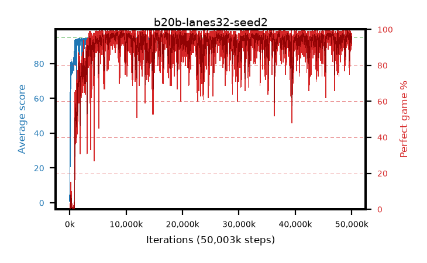

# b20b-lanes32-seed2

step **50,003,968** · 12208 evals · trailing **94.06** · peak **94.68** @15,556,608 · sef **89.9** · best30 **98.3** @49,250,304

## Config

| | |
|---|---|
| algo | ppo |
| collect_envs | 32 |
| discount | 0.99 |
| eval_interval | 4096 |
| eval_queue | True |
| eval_queue_depth | 16 |
| eval_workers | 8 |
| fc_layers | (320,) |
| graph_eval_episodes | 100 |
| max_steps | 50003968 |
| min_checkpoint_score | 40.0 |
| ppo_adam_epsilon | 1e-07 |
| ppo_anneal_fraction | 1.0 |
| ppo_clip | 0.2 |
| ppo_clip_final | None |
| ppo_entropy_coef | 0.01 |
| ppo_entropy_coef_final | None |
| ppo_epochs | 4 |
| ppo_gae_lambda | 0.98 |
| ppo_gradient_clipping | 0.5 |
| ppo_horizon | 33.6 |
| ppo_learning_rate | 0.0003 |
| ppo_learning_rate_final | None |
| ppo_minibatch | 256 |
| ppo_normalize_adv | True |
| ppo_rollout | 128 |
| ppo_target_kl | 0.0 |
| ppo_transitions_per_rollout | 4096 |
| ppo_value_loss | huber |
| ppo_vf_coef | 0.5 |
| seed | 2 |
| torch_threads | 1 |

## Evals

| step | avg score | trailing avg | min score | max score | avg reward | perfect % | epsilon |
|---|---|---|---|---|---|---|---|
| 4096 | 0.97 | 0.97 | 0.0 | 6.0 | 0.108 | 0.0 |  |
| 8192 | 1.22 | 1.09 | 0.0 | 7.0 | 0.667 | 0.0 |  |
| 12288 | 2.91 | 6.08 | 1.0 | 8.0 | 2.266 | 0.0 |  |
| ... | ... | ... | ... | ... | ... | ... | ... |
| 49958912 | 94.51 | 93.8 | 79.0 | 95.0 | 187.211 | 94.0 |  |
| 49963008 | 94.64 | 93.88 | 69.0 | 95.0 | 190.331 | 97.0 |  |
| 49967104 | 93.88 | 93.85 | 46.0 | 95.0 | 186.528 | 94.0 |  |
| 49971200 | 94.06 | 93.91 | 28.0 | 95.0 | 186.736 | 94.0 |  |
| 49975296 | 94.61 | 93.87 | 73.0 | 95.0 | 191.305 | 98.0 |  |
| 49979392 | 93.23 | 93.85 | 14.0 | 95.0 | 186.895 | 95.0 |  |
| 49983488 | 94.39 | 94.01 | 66.0 | 95.0 | 187.087 | 94.0 |  |
| 49987584 | 94.41 | 93.97 | 74.0 | 95.0 | 187.124 | 94.0 |  |
| 49991680 | 94.39 | 93.93 | 78.0 | 95.0 | 187.091 | 94.0 |  |
| 49995776 | 94.02 | 93.94 | 78.0 | 95.0 | 183.726 | 91.0 |  |
| 49999872 | 94.73 | 94.06 | 86.0 | 95.0 | 189.424 | 96.0 |  |
| 50003968 | 93.68 | 94.06 | 10.0 | 95.0 | 186.393 | 94.0 |  |
