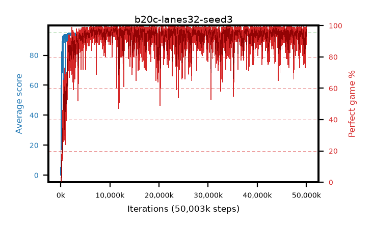

# b20c-lanes32-seed3

step **50,003,968** · 12208 evals · trailing **94.38** · peak **94.74** @11,354,112 · sef **93.4** · best30 **98.2** @11,354,112

## Config

| | |
|---|---|
| algo | ppo |
| collect_envs | 32 |
| discount | 0.99 |
| eval_interval | 4096 |
| eval_queue | True |
| eval_queue_depth | 16 |
| eval_workers | 8 |
| fc_layers | (320,) |
| graph_eval_episodes | 100 |
| max_steps | 50003968 |
| min_checkpoint_score | 40.0 |
| ppo_adam_epsilon | 1e-07 |
| ppo_anneal_fraction | 1.0 |
| ppo_clip | 0.2 |
| ppo_clip_final | None |
| ppo_entropy_coef | 0.01 |
| ppo_entropy_coef_final | None |
| ppo_epochs | 4 |
| ppo_gae_lambda | 0.98 |
| ppo_gradient_clipping | 0.5 |
| ppo_horizon | 33.6 |
| ppo_learning_rate | 0.0003 |
| ppo_learning_rate_final | None |
| ppo_minibatch | 256 |
| ppo_normalize_adv | True |
| ppo_rollout | 128 |
| ppo_target_kl | 0.0 |
| ppo_transitions_per_rollout | 4096 |
| ppo_value_loss | huber |
| ppo_vf_coef | 0.5 |
| seed | 3 |
| torch_threads | 1 |

## Evals

| step | avg score | trailing avg | min score | max score | avg reward | perfect % | epsilon |
|---|---|---|---|---|---|---|---|
| 4096 | 0.04 | 0.04 | 0.0 | 1.0 | -0.689 | 0.0 |  |
| 8192 | 0.52 | 0.28 | 0.0 | 3.0 | -0.301 | 0.0 |  |
| 12288 | 7.02 | 10.45 | 2.0 | 19.0 | 2.172 | 0.0 |  |
| ... | ... | ... | ... | ... | ... | ... | ... |
| 49958912 | 95.0 | 94.5 | 95.0 | 95.0 | 193.69 | 100.0 |  |
| 49963008 | 94.84 | 94.53 | 79.0 | 95.0 | 192.53 | 99.0 |  |
| 49967104 | 94.28 | 94.52 | 67.0 | 95.0 | 187.986 | 95.0 |  |
| 49971200 | 94.29 | 94.55 | 64.0 | 95.0 | 186.977 | 94.0 |  |
| 49975296 | 94.16 | 94.53 | 72.0 | 95.0 | 185.863 | 93.0 |  |
| 49979392 | 93.64 | 94.48 | 64.0 | 95.0 | 182.34 | 90.0 |  |
| 49983488 | 94.33 | 94.46 | 67.0 | 95.0 | 188.028 | 95.0 |  |
| 49987584 | 94.28 | 94.52 | 64.0 | 95.0 | 187.96 | 95.0 |  |
| 49991680 | 93.95 | 94.49 | 68.0 | 95.0 | 184.655 | 92.0 |  |
| 49995776 | 92.19 | 94.41 | 14.0 | 95.0 | 178.878 | 88.0 |  |
| 49999872 | 94.56 | 94.49 | 82.0 | 95.0 | 188.257 | 95.0 |  |
| 50003968 | 93.91 | 94.38 | 59.0 | 95.0 | 187.624 | 95.0 |  |
