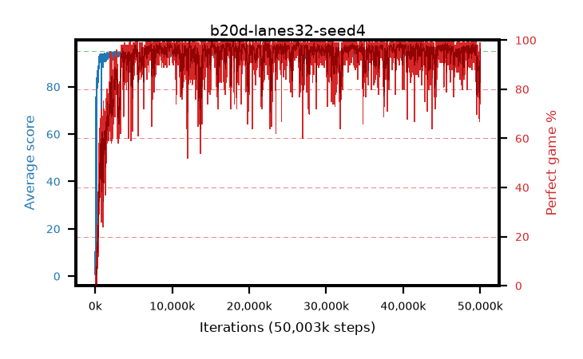

# b20d-lanes32-seed4

step **50,003,968** · 12208 evals · trailing **92.88** · peak **94.79** @17,920,000 · sef **92.3** · best30 **98.8** @17,944,576

## Config

| | |
|---|---|
| algo | ppo |
| collect_envs | 32 |
| discount | 0.99 |
| eval_interval | 4096 |
| eval_queue | True |
| eval_queue_depth | 16 |
| eval_workers | 8 |
| fc_layers | (320,) |
| graph_eval_episodes | 100 |
| max_steps | 50003968 |
| min_checkpoint_score | 40.0 |
| ppo_adam_epsilon | 1e-07 |
| ppo_anneal_fraction | 1.0 |
| ppo_clip | 0.2 |
| ppo_clip_final | None |
| ppo_entropy_coef | 0.01 |
| ppo_entropy_coef_final | None |
| ppo_epochs | 4 |
| ppo_gae_lambda | 0.98 |
| ppo_gradient_clipping | 0.5 |
| ppo_horizon | 33.6 |
| ppo_learning_rate | 0.0003 |
| ppo_learning_rate_final | None |
| ppo_minibatch | 256 |
| ppo_normalize_adv | True |
| ppo_rollout | 128 |
| ppo_target_kl | 0.0 |
| ppo_transitions_per_rollout | 4096 |
| ppo_value_loss | huber |
| ppo_vf_coef | 0.5 |
| seed | 4 |
| torch_threads | 1 |

## Evals

| step | avg score | trailing avg | min score | max score | avg reward | perfect % | epsilon |
|---|---|---|---|---|---|---|---|
| 4096 | 0.69 | 7.7 | 0.0 | 4.0 | -2.405 | 0.0 |  |
| 8192 | 9.16 | 8.19 | 1.0 | 21.0 | 4.189 | 0.0 |  |
| 12288 | 13.85 | 11.08 | 2.0 | 29.0 | 8.845 | 0.0 |  |
| ... | ... | ... | ... | ... | ... | ... | ... |
| 49958912 | 93.19 | 92.1 | 22.0 | 95.0 | 182.874 | 91.0 |  |
| 49963008 | 93.67 | 92.35 | 65.0 | 95.0 | 184.321 | 92.0 |  |
| 49967104 | 94.01 | 92.2 | 47.0 | 95.0 | 189.609 | 97.0 |  |
| 49971200 | 93.94 | 92.31 | 14.0 | 95.0 | 190.638 | 98.0 |  |
| 49975296 | 94.85 | 92.86 | 87.0 | 95.0 | 191.533 | 98.0 |  |
| 49979392 | 94.6 | 92.64 | 80.0 | 95.0 | 189.258 | 96.0 |  |
| 49983488 | 94.55 | 92.78 | 50.0 | 95.0 | 192.194 | 99.0 |  |
| 49987584 | 94.08 | 92.52 | 30.0 | 95.0 | 188.735 | 96.0 |  |
| 49991680 | 93.8 | 92.39 | 18.0 | 95.0 | 188.504 | 96.0 |  |
| 49995776 | 92.8 | 92.34 | 16.0 | 95.0 | 185.372 | 94.0 |  |
| 49999872 | 94.72 | 92.49 | 80.0 | 95.0 | 191.414 | 98.0 |  |
| 50003968 | 94.14 | 92.88 | 75.0 | 95.0 | 186.792 | 94.0 |  |
