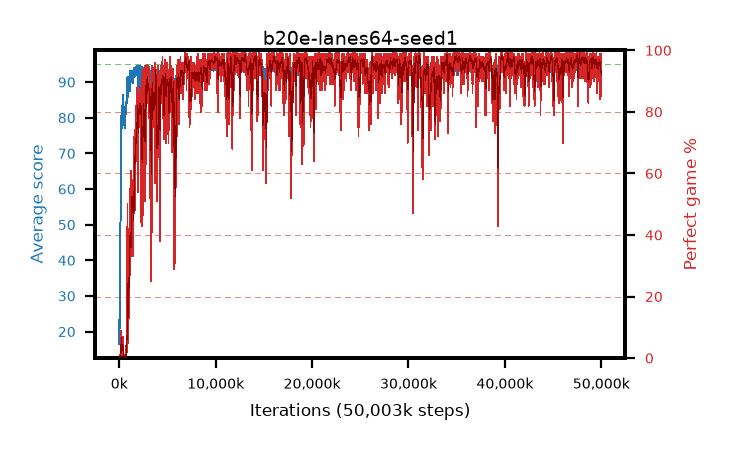

# b20e-lanes64-seed1

step **50,003,968** · 6104 evals · trailing **94.23** · peak **94.57** @40,411,136 · sef **91.1** · best30 **97.7** @36,487,168

## Config

| | |
|---|---|
| algo | ppo |
| collect_envs | 64 |
| discount | 0.99 |
| eval_interval | 8192 |
| eval_queue | True |
| eval_queue_depth | 16 |
| eval_workers | 8 |
| fc_layers | (320,) |
| graph_eval_episodes | 100 |
| max_steps | 50003968 |
| min_checkpoint_score | 40.0 |
| ppo_adam_epsilon | 1e-07 |
| ppo_anneal_fraction | 1.0 |
| ppo_clip | 0.2 |
| ppo_clip_final | None |
| ppo_entropy_coef | 0.01 |
| ppo_entropy_coef_final | None |
| ppo_epochs | 4 |
| ppo_gae_lambda | 0.98 |
| ppo_gradient_clipping | 0.5 |
| ppo_horizon | 33.6 |
| ppo_learning_rate | 0.0003 |
| ppo_learning_rate_final | None |
| ppo_minibatch | 256 |
| ppo_normalize_adv | True |
| ppo_rollout | 128 |
| ppo_target_kl | 0.0 |
| ppo_transitions_per_rollout | 8192 |
| ppo_value_loss | huber |
| ppo_vf_coef | 0.5 |
| seed | 1 |
| torch_threads | 1 |

## Evals

| step | avg score | trailing avg | min score | max score | avg reward | perfect % | epsilon |
|---|---|---|---|---|---|---|---|
| 8192 | 23.38 | 21.71 | 1.0 | 43.0 | 19.109 | 0.0 |  |
| 16384 | 16.49 | 16.67 | 5.0 | 32.0 | 11.569 | 0.0 |  |
| 24576 | 16.85 | 16.85 | 2.0 | 31.0 | 11.843 | 0.0 |  |
| ... | ... | ... | ... | ... | ... | ... | ... |
| 49913856 | 93.88 | 94.11 | 64.0 | 95.0 | 185.59 | 93.0 |  |
| 49922048 | 94.33 | 94.17 | 64.0 | 95.0 | 187.036 | 94.0 |  |
| 49930240 | 93.9 | 94.23 | 76.0 | 95.0 | 182.618 | 90.0 |  |
| 49938432 | 94.18 | 94.27 | 77.0 | 95.0 | 182.847 | 90.0 |  |
| 49946624 | 93.2 | 94.24 | 62.0 | 95.0 | 179.873 | 88.0 |  |
| 49954816 | 93.16 | 94.19 | 6.0 | 95.0 | 185.88 | 94.0 |  |
| 49963008 | 93.94 | 94.34 | 73.0 | 95.0 | 183.648 | 91.0 |  |
| 49971200 | 94.3 | 94.27 | 62.0 | 95.0 | 187.966 | 95.0 |  |
| 49979392 | 94.82 | 94.22 | 88.0 | 95.0 | 190.515 | 97.0 |  |
| 49987584 | 94.9 | 94.28 | 85.0 | 95.0 | 192.607 | 99.0 |  |
| 49995776 | 92.41 | 94.32 | 22.0 | 95.0 | 176.083 | 85.0 |  |
| 50003968 | 94.16 | 94.23 | 74.0 | 95.0 | 182.855 | 90.0 |  |
