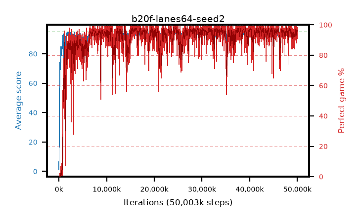

# b20f-lanes64-seed2

step **50,003,968** · 6104 evals · trailing **94.08** · peak **94.58** @42,131,456 · sef **91.4** · best30 **98.0** @24,535,040

## Config

| | |
|---|---|
| algo | ppo |
| collect_envs | 64 |
| discount | 0.99 |
| eval_interval | 8192 |
| eval_queue | True |
| eval_queue_depth | 16 |
| eval_workers | 8 |
| fc_layers | (320,) |
| graph_eval_episodes | 100 |
| max_steps | 50003968 |
| min_checkpoint_score | 40.0 |
| ppo_adam_epsilon | 1e-07 |
| ppo_anneal_fraction | 1.0 |
| ppo_clip | 0.2 |
| ppo_clip_final | None |
| ppo_entropy_coef | 0.01 |
| ppo_entropy_coef_final | None |
| ppo_epochs | 4 |
| ppo_gae_lambda | 0.98 |
| ppo_gradient_clipping | 0.5 |
| ppo_horizon | 33.6 |
| ppo_learning_rate | 0.0003 |
| ppo_learning_rate_final | None |
| ppo_minibatch | 256 |
| ppo_normalize_adv | True |
| ppo_rollout | 128 |
| ppo_target_kl | 0.0 |
| ppo_transitions_per_rollout | 8192 |
| ppo_value_loss | huber |
| ppo_vf_coef | 0.5 |
| seed | 2 |
| torch_threads | 1 |

## Evals

| step | avg score | trailing avg | min score | max score | avg reward | perfect % | epsilon |
|---|---|---|---|---|---|---|---|
| 8192 | 1.08 | 1.08 | 0.0 | 5.0 | -0.684 | 0.0 |  |
| 16384 | 6.37 | 7.86 | 2.0 | 16.0 | 1.398 | 0.0 |  |
| 24576 | 9.07 | 5.08 | 2.0 | 22.0 | 4.063 | 0.0 |  |
| ... | ... | ... | ... | ... | ... | ... | ... |
| 49913856 | 94.47 | 94.06 | 66.0 | 95.0 | 190.209 | 97.0 |  |
| 49922048 | 94.89 | 94.07 | 84.0 | 95.0 | 192.617 | 99.0 |  |
| 49930240 | 94.7 | 93.99 | 79.0 | 95.0 | 191.422 | 98.0 |  |
| 49938432 | 94.84 | 94.07 | 84.0 | 95.0 | 191.569 | 98.0 |  |
| 49946624 | 94.49 | 94.09 | 79.0 | 95.0 | 188.213 | 95.0 |  |
| 49954816 | 94.45 | 94.1 | 57.0 | 95.0 | 191.193 | 98.0 |  |
| 49963008 | 92.22 | 93.98 | 8.0 | 95.0 | 181.932 | 91.0 |  |
| 49971200 | 94.35 | 94.01 | 82.0 | 95.0 | 186.082 | 93.0 |  |
| 49979392 | 94.48 | 94.03 | 60.0 | 95.0 | 191.21 | 98.0 |  |
| 49987584 | 94.05 | 94.0 | 69.0 | 95.0 | 187.776 | 95.0 |  |
| 49995776 | 94.22 | 94.05 | 72.0 | 95.0 | 187.961 | 95.0 |  |
| 50003968 | 94.61 | 94.08 | 84.0 | 95.0 | 189.331 | 96.0 |  |
