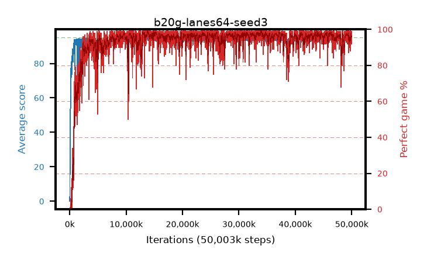

# b20g-lanes64-seed3

step **50,003,968** · 6104 evals · trailing **94.36** · peak **94.76** @33,996,800 · sef **94.8** · best30 **98.6** @34,004,992

## Config

| | |
|---|---|
| algo | ppo |
| collect_envs | 64 |
| discount | 0.99 |
| eval_interval | 8192 |
| eval_queue | True |
| eval_queue_depth | 16 |
| eval_workers | 8 |
| fc_layers | (320,) |
| graph_eval_episodes | 100 |
| max_steps | 50003968 |
| min_checkpoint_score | 40.0 |
| ppo_adam_epsilon | 1e-07 |
| ppo_anneal_fraction | 1.0 |
| ppo_clip | 0.2 |
| ppo_clip_final | None |
| ppo_entropy_coef | 0.01 |
| ppo_entropy_coef_final | None |
| ppo_epochs | 4 |
| ppo_gae_lambda | 0.98 |
| ppo_gradient_clipping | 0.5 |
| ppo_horizon | 33.6 |
| ppo_learning_rate | 0.0003 |
| ppo_learning_rate_final | None |
| ppo_minibatch | 256 |
| ppo_normalize_adv | True |
| ppo_rollout | 128 |
| ppo_target_kl | 0.0 |
| ppo_transitions_per_rollout | 8192 |
| ppo_value_loss | huber |
| ppo_vf_coef | 0.5 |
| seed | 3 |
| torch_threads | 1 |

## Evals

| step | avg score | trailing avg | min score | max score | avg reward | perfect % | epsilon |
|---|---|---|---|---|---|---|---|
| 8192 | 0.07 | 0.07 | 0.0 | 1.0 | -3.106 | 0.0 |  |
| 16384 | 1.45 | 0.76 | 1.0 | 4.0 | 0.62 | 0.0 |  |
| 24576 | 10.37 | 3.96 | 0.0 | 25.0 | 6.715 | 0.0 |  |
| ... | ... | ... | ... | ... | ... | ... | ... |
| 49913856 | 94.18 | 94.3 | 78.0 | 95.0 | 186.912 | 94.0 |  |
| 49922048 | 93.76 | 94.17 | 24.0 | 95.0 | 188.493 | 96.0 |  |
| 49930240 | 93.94 | 94.23 | 73.0 | 95.0 | 184.686 | 92.0 |  |
| 49938432 | 93.73 | 94.18 | 37.0 | 95.0 | 189.381 | 97.0 |  |
| 49946624 | 94.17 | 94.22 | 62.0 | 95.0 | 187.902 | 95.0 |  |
| 49954816 | 94.01 | 94.22 | 14.0 | 95.0 | 190.745 | 98.0 |  |
| 49963008 | 94.87 | 94.2 | 82.0 | 95.0 | 192.59 | 99.0 |  |
| 49971200 | 93.77 | 94.16 | 12.0 | 95.0 | 189.504 | 97.0 |  |
| 49979392 | 93.19 | 94.19 | 12.0 | 95.0 | 186.886 | 95.0 |  |
| 49987584 | 94.64 | 94.31 | 76.0 | 95.0 | 191.369 | 98.0 |  |
| 49995776 | 94.09 | 94.36 | 57.0 | 95.0 | 187.818 | 95.0 |  |
| 50003968 | 94.57 | 94.36 | 68.0 | 95.0 | 191.292 | 98.0 |  |
