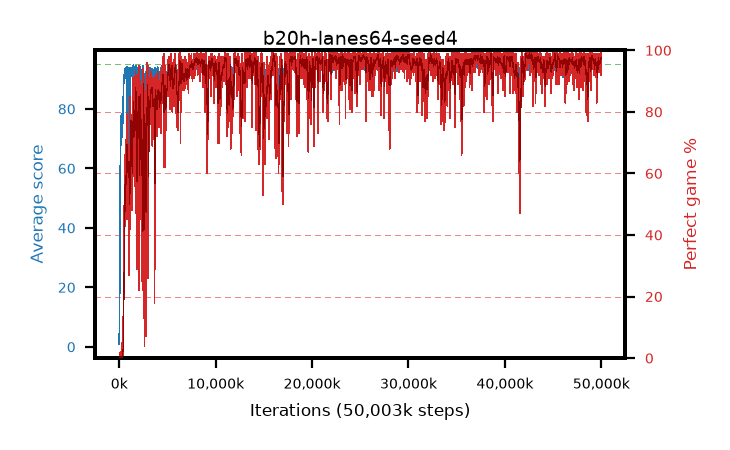

# b20h-lanes64-seed4

step **50,003,968** · 6104 evals · trailing **94.27** · peak **94.65** @37,371,904 · sef **91.5** · best30 **98.3** @42,360,832

## Config

| | |
|---|---|
| algo | ppo |
| collect_envs | 64 |
| discount | 0.99 |
| eval_interval | 8192 |
| eval_queue | True |
| eval_queue_depth | 16 |
| eval_workers | 8 |
| fc_layers | (320,) |
| graph_eval_episodes | 100 |
| max_steps | 50003968 |
| min_checkpoint_score | 40.0 |
| ppo_adam_epsilon | 1e-07 |
| ppo_anneal_fraction | 1.0 |
| ppo_clip | 0.2 |
| ppo_clip_final | None |
| ppo_entropy_coef | 0.01 |
| ppo_entropy_coef_final | None |
| ppo_epochs | 4 |
| ppo_gae_lambda | 0.98 |
| ppo_gradient_clipping | 0.5 |
| ppo_horizon | 33.6 |
| ppo_learning_rate | 0.0003 |
| ppo_learning_rate_final | None |
| ppo_minibatch | 256 |
| ppo_normalize_adv | True |
| ppo_rollout | 128 |
| ppo_target_kl | 0.0 |
| ppo_transitions_per_rollout | 8192 |
| ppo_value_loss | huber |
| ppo_vf_coef | 0.5 |
| seed | 4 |
| torch_threads | 1 |

## Evals

| step | avg score | trailing avg | min score | max score | avg reward | perfect % | epsilon |
|---|---|---|---|---|---|---|---|
| 8192 | 0.92 | 2.1 | 0.0 | 2.0 | -0.302 | 0.0 |  |
| 16384 | 3.27 | 3.27 | 2.0 | 7.0 | -1.737 | 0.0 |  |
| 24576 | 10.91 | 5.03 | 2.0 | 20.0 | 5.904 | 0.0 |  |
| ... | ... | ... | ... | ... | ... | ... | ... |
| 49913856 | 94.74 | 94.3 | 69.0 | 95.0 | 192.458 | 99.0 |  |
| 49922048 | 94.31 | 94.37 | 56.0 | 95.0 | 190.033 | 97.0 |  |
| 49930240 | 94.85 | 94.34 | 80.0 | 95.0 | 192.574 | 99.0 |  |
| 49938432 | 94.98 | 94.38 | 93.0 | 95.0 | 192.708 | 99.0 |  |
| 49946624 | 95.0 | 94.38 | 95.0 | 95.0 | 193.715 | 100.0 |  |
| 49954816 | 93.7 | 94.35 | 10.0 | 95.0 | 188.432 | 96.0 |  |
| 49963008 | 94.83 | 94.36 | 81.0 | 95.0 | 191.501 | 98.0 |  |
| 49971200 | 94.37 | 94.34 | 58.0 | 95.0 | 190.077 | 97.0 |  |
| 49979392 | 93.19 | 94.32 | 16.0 | 95.0 | 183.907 | 92.0 |  |
| 49987584 | 94.57 | 94.27 | 62.0 | 95.0 | 191.263 | 98.0 |  |
| 49995776 | 93.78 | 94.23 | 37.0 | 95.0 | 188.434 | 96.0 |  |
| 50003968 | 94.89 | 94.27 | 84.0 | 95.0 | 192.586 | 99.0 |  |
