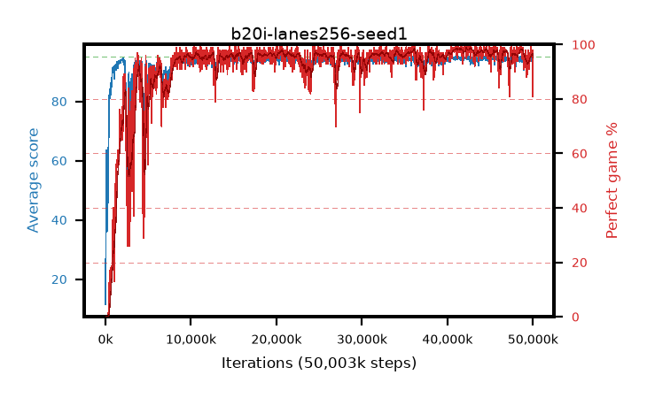

# b20i-lanes256-seed1

step **50,003,968** · 1526 evals · trailing **93.73** · peak **94.6** @41,418,752 · sef **92.1** · best30 **98.4** @42,860,544

## Config

| | |
|---|---|
| algo | ppo |
| collect_envs | 256 |
| discount | 0.99 |
| eval_interval | 32768 |
| eval_queue | True |
| eval_queue_depth | 16 |
| eval_workers | 8 |
| fc_layers | (320,) |
| graph_eval_episodes | 100 |
| max_steps | 50003968 |
| min_checkpoint_score | 40.0 |
| ppo_adam_epsilon | 1e-07 |
| ppo_anneal_fraction | 1.0 |
| ppo_clip | 0.2 |
| ppo_clip_final | None |
| ppo_entropy_coef | 0.01 |
| ppo_entropy_coef_final | None |
| ppo_epochs | 4 |
| ppo_gae_lambda | 0.98 |
| ppo_gradient_clipping | 0.5 |
| ppo_horizon | 33.6 |
| ppo_learning_rate | 0.0003 |
| ppo_learning_rate_final | None |
| ppo_minibatch | 256 |
| ppo_normalize_adv | True |
| ppo_rollout | 128 |
| ppo_target_kl | 0.0 |
| ppo_transitions_per_rollout | 32768 |
| ppo_value_loss | huber |
| ppo_vf_coef | 0.5 |
| seed | 1 |
| torch_threads | 1 |

## Evals

| step | avg score | trailing avg | min score | max score | avg reward | perfect % | epsilon |
|---|---|---|---|---|---|---|---|
| 32768 | 11.51 | 11.51 | 1.0 | 31.0 | 10.814 | 0.0 |  |
| 65536 | 63.49 | 39.99 | 19.0 | 87.0 | 61.223 | 0.0 |  |
| 98304 | 50.02 | 35.07 | 16.0 | 84.0 | 44.836 | 0.0 |  |
| ... | ... | ... | ... | ... | ... | ... | ... |
| 49643520 | 93.8 | 93.67 | 22.0 | 95.0 | 186.516 | 94.0 |  |
| 49676288 | 94.19 | 93.6 | 65.0 | 95.0 | 187.916 | 95.0 |  |
| 49709056 | 93.84 | 93.56 | 7.0 | 95.0 | 189.565 | 97.0 |  |
| 49741824 | 93.52 | 93.6 | 1.0 | 95.0 | 189.246 | 97.0 |  |
| 49774592 | 95.0 | 93.6 | 95.0 | 95.0 | 193.721 | 100.0 |  |
| 49807360 | 94.65 | 93.63 | 67.0 | 95.0 | 190.328 | 97.0 |  |
| 49840128 | 93.77 | 93.87 | 14.0 | 95.0 | 188.481 | 96.0 |  |
| 49872896 | 93.55 | 93.81 | 8.0 | 95.0 | 188.271 | 96.0 |  |
| 49905664 | 94.92 | 93.67 | 90.0 | 95.0 | 191.636 | 98.0 |  |
| 49938432 | 94.0 | 93.86 | 9.0 | 95.0 | 190.717 | 98.0 |  |
| 49971200 | 93.53 | 93.72 | 63.0 | 95.0 | 182.274 | 90.0 |  |
| 50003968 | 90.62 | 93.73 | 7.0 | 95.0 | 170.381 | 81.0 |  |
