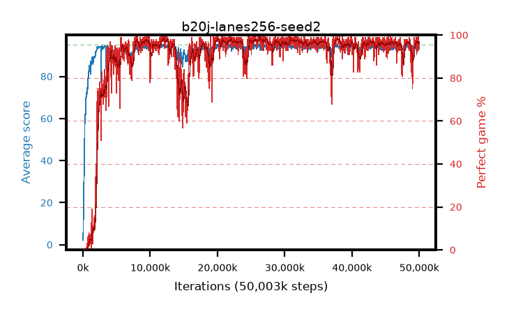

# b20j-lanes256-seed2

step **50,003,968** · 1526 evals · trailing **93.94** · peak **94.54** @12,353,536 · sef **89.3** · best30 **98.0** @26,312,704

## Config

| | |
|---|---|
| algo | ppo |
| collect_envs | 256 |
| discount | 0.99 |
| eval_interval | 32768 |
| eval_queue | True |
| eval_queue_depth | 16 |
| eval_workers | 8 |
| fc_layers | (320,) |
| graph_eval_episodes | 100 |
| max_steps | 50003968 |
| min_checkpoint_score | 40.0 |
| ppo_adam_epsilon | 1e-07 |
| ppo_anneal_fraction | 1.0 |
| ppo_clip | 0.2 |
| ppo_clip_final | None |
| ppo_entropy_coef | 0.01 |
| ppo_entropy_coef_final | None |
| ppo_epochs | 4 |
| ppo_gae_lambda | 0.98 |
| ppo_gradient_clipping | 0.5 |
| ppo_horizon | 33.6 |
| ppo_learning_rate | 0.0003 |
| ppo_learning_rate_final | None |
| ppo_minibatch | 256 |
| ppo_normalize_adv | True |
| ppo_rollout | 128 |
| ppo_target_kl | 0.0 |
| ppo_transitions_per_rollout | 32768 |
| ppo_value_loss | huber |
| ppo_vf_coef | 0.5 |
| seed | 2 |
| torch_threads | 1 |

## Evals

| step | avg score | trailing avg | min score | max score | avg reward | perfect % | epsilon |
|---|---|---|---|---|---|---|---|
| 32768 | 2.17 | 2.17 | 1.0 | 5.0 | -2.001 | 0.0 |  |
| 65536 | 14.8 | 8.48 | 5.0 | 26.0 | 9.892 | 0.0 |  |
| 98304 | 25.89 | 14.29 | 6.0 | 53.0 | 20.881 | 0.0 |  |
| ... | ... | ... | ... | ... | ... | ... | ... |
| 49643520 | 94.88 | 93.72 | 83.0 | 95.0 | 192.602 | 99.0 |  |
| 49676288 | 94.2 | 93.79 | 32.0 | 95.0 | 190.88 | 98.0 |  |
| 49709056 | 93.36 | 93.82 | 7.0 | 95.0 | 187.043 | 95.0 |  |
| 49741824 | 93.09 | 93.75 | 8.0 | 95.0 | 186.838 | 95.0 |  |
| 49774592 | 94.66 | 93.72 | 61.0 | 95.0 | 192.389 | 99.0 |  |
| 49807360 | 92.94 | 93.67 | 12.0 | 95.0 | 187.68 | 96.0 |  |
| 49840128 | 94.8 | 93.87 | 84.0 | 95.0 | 191.513 | 98.0 |  |
| 49872896 | 92.61 | 93.83 | 28.0 | 95.0 | 184.232 | 93.0 |  |
| 49905664 | 95.0 | 93.87 | 95.0 | 95.0 | 193.711 | 100.0 |  |
| 49938432 | 93.07 | 93.84 | 28.0 | 95.0 | 186.802 | 95.0 |  |
| 49971200 | 94.61 | 93.96 | 81.0 | 95.0 | 189.334 | 96.0 |  |
| 50003968 | 93.51 | 93.94 | 3.0 | 95.0 | 187.191 | 95.0 |  |
