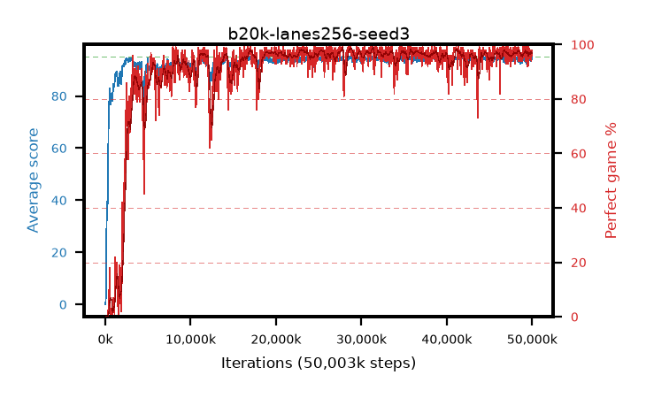

# b20k-lanes256-seed3

step **50,003,968** · 1526 evals · trailing **94.24** · peak **94.58** @41,943,040 · sef **91.4** · best30 **97.8** @23,625,728

## Config

| | |
|---|---|
| algo | ppo |
| collect_envs | 256 |
| discount | 0.99 |
| eval_interval | 32768 |
| eval_queue | True |
| eval_queue_depth | 16 |
| eval_workers | 8 |
| fc_layers | (320,) |
| graph_eval_episodes | 100 |
| max_steps | 50003968 |
| min_checkpoint_score | 40.0 |
| ppo_adam_epsilon | 1e-07 |
| ppo_anneal_fraction | 1.0 |
| ppo_clip | 0.2 |
| ppo_clip_final | None |
| ppo_entropy_coef | 0.01 |
| ppo_entropy_coef_final | None |
| ppo_epochs | 4 |
| ppo_gae_lambda | 0.98 |
| ppo_gradient_clipping | 0.5 |
| ppo_horizon | 33.6 |
| ppo_learning_rate | 0.0003 |
| ppo_learning_rate_final | None |
| ppo_minibatch | 256 |
| ppo_normalize_adv | True |
| ppo_rollout | 128 |
| ppo_target_kl | 0.0 |
| ppo_transitions_per_rollout | 32768 |
| ppo_value_loss | huber |
| ppo_vf_coef | 0.5 |
| seed | 3 |
| torch_threads | 1 |

## Evals

| step | avg score | trailing avg | min score | max score | avg reward | perfect % | epsilon |
|---|---|---|---|---|---|---|---|
| 32768 | 0.04 | 0.04 | 0.0 | 1.0 | -4.168 | 0.0 |  |
| 65536 | 2.75 | 1.4 | 0.0 | 9.0 | 2.133 | 0.0 |  |
| 98304 | 20.45 | 26.15 | 0.0 | 43.0 | 17.27 | 0.0 |  |
| ... | ... | ... | ... | ... | ... | ... | ... |
| 49643520 | 93.6 | 94.25 | 24.0 | 95.0 | 187.335 | 95.0 |  |
| 49676288 | 94.01 | 94.22 | 57.0 | 95.0 | 188.73 | 96.0 |  |
| 49709056 | 94.76 | 94.27 | 82.0 | 95.0 | 190.477 | 97.0 |  |
| 49741824 | 94.62 | 94.26 | 81.0 | 95.0 | 190.328 | 97.0 |  |
| 49774592 | 94.26 | 94.26 | 59.0 | 95.0 | 189.983 | 97.0 |  |
| 49807360 | 94.31 | 94.28 | 61.0 | 95.0 | 190.029 | 97.0 |  |
| 49840128 | 93.52 | 94.29 | 6.0 | 95.0 | 189.254 | 97.0 |  |
| 49872896 | 94.03 | 94.28 | 22.0 | 95.0 | 190.749 | 98.0 |  |
| 49905664 | 93.86 | 94.25 | 63.0 | 95.0 | 186.59 | 94.0 |  |
| 49938432 | 94.8 | 94.24 | 83.0 | 95.0 | 191.501 | 98.0 |  |
| 49971200 | 94.11 | 94.23 | 28.0 | 95.0 | 188.845 | 96.0 |  |
| 50003968 | 94.38 | 94.24 | 63.0 | 95.0 | 191.065 | 98.0 |  |
